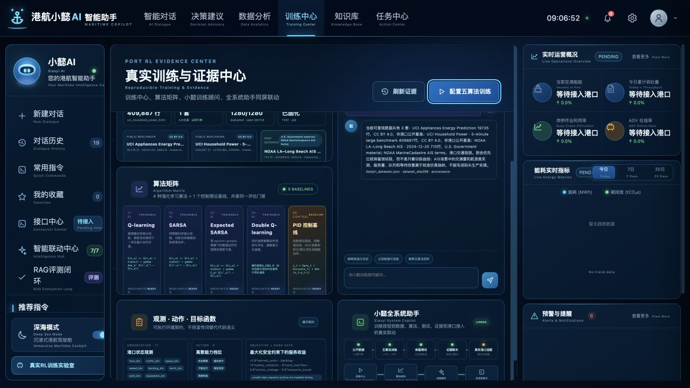
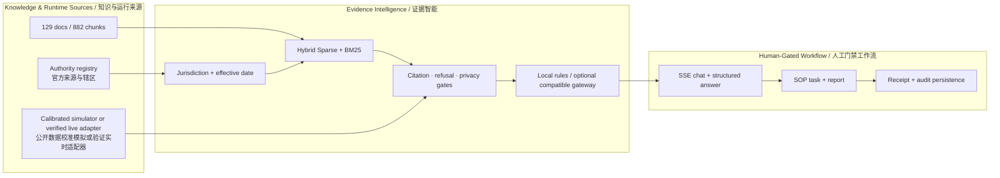
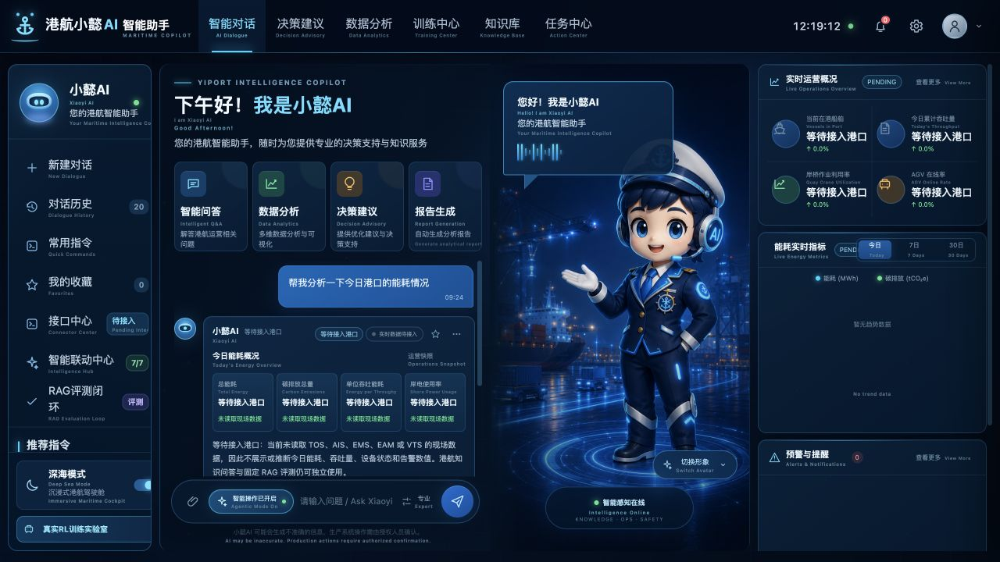
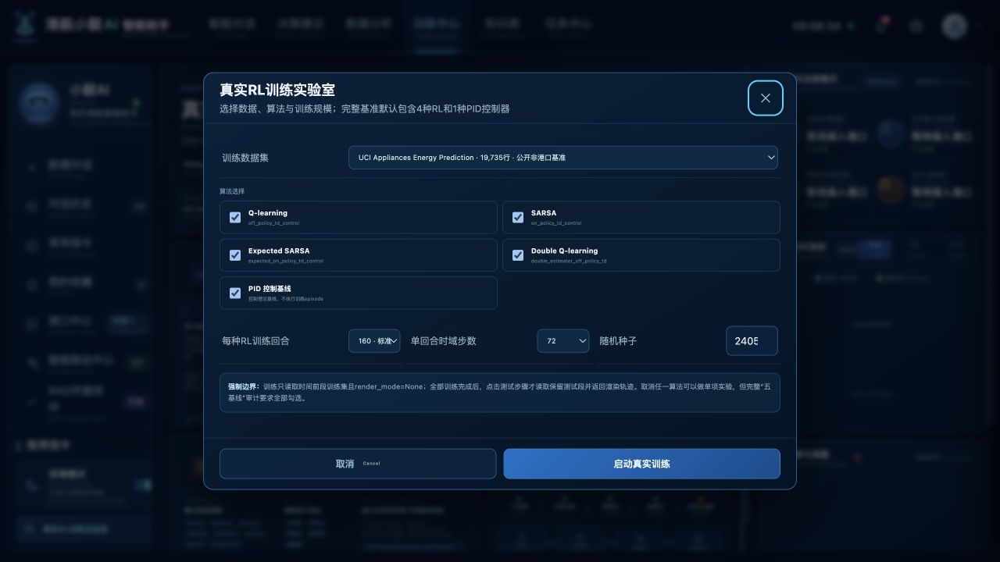
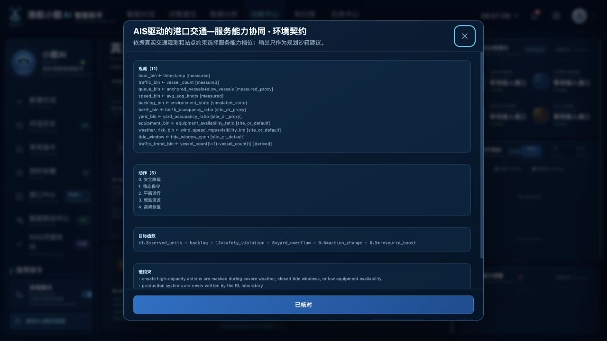
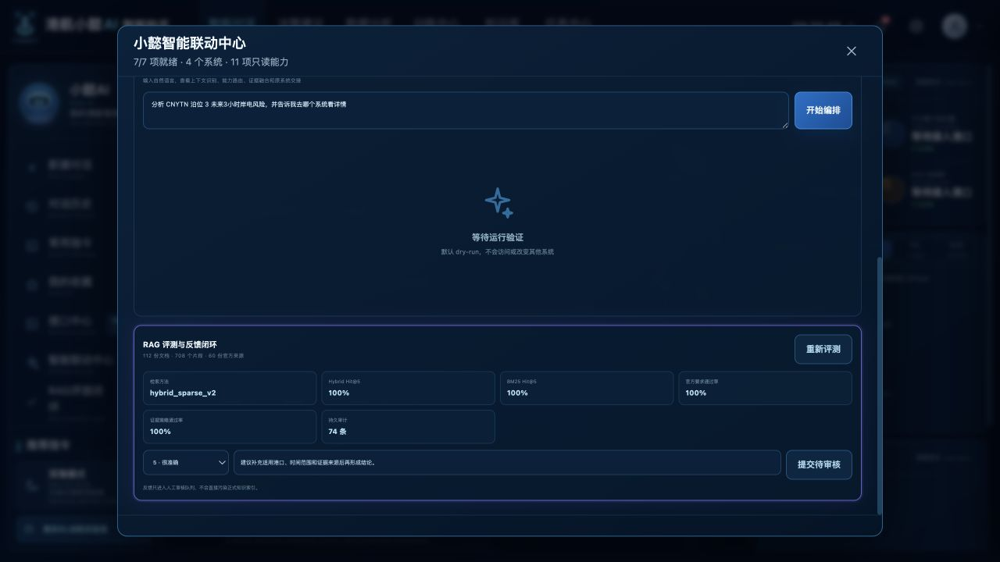

<table>
  <tr>
    <td width="64%" valign="middle">
      <p><code>OPEN-WEIGHT LLM · RAG · LORA · EVIDENCE GOVERNANCE</code></p>
      <h1>小懿 AI · 港航垂直行业生成式大模型研发项目</h1>
      <h3>Xiaoyi AI · Open-Weight Maritime LLM with RAG, LoRA &amp; Evidence Governance</h3>
      <p><strong>研发作者：</strong>温家懿 · <strong>Research Author:</strong> Wen Jiayi</p>
      <p><strong>把港航问答从“模型说了什么”，提升为“证据来自哪里、适用于哪个辖区和日期、何时必须拒答、谁允许推进任务”的可审计决策链。</strong></p>
      <p><em>A local generative maritime model stack where retrieval, adaptation, jurisdiction, temporal applicability, refusal, and audit evidence remain independently reviewable.</em></p>
      <p><strong>129</strong> 登记文档 · <strong>882</strong> 知识分块 · <strong>68</strong> 官方来源 · <strong>260</strong> 题六版本基准</p>
    </td>
    <td width="36%" align="center">
      
    </td>
  </tr>
</table>

<p align="center">
  <a href="https://github.com/wenjiayi123/xiaoyi-maritime-ai/actions/workflows/ci.yml"></a>
  <a href="https://github.com/wenjiayi123/xiaoyi-maritime-ai/actions/workflows/codeql.yml"></a>
  <a href="https://github.com/wenjiayi123/xiaoyi-maritime-ai/actions/workflows/dependency-audit.yml"></a>
  <a href="LICENSE"></a>
  
  
  
  
  
</p>

<p align="center">
  <a href="#核心证明数据--headline-evidence">核心指标 / Evidence</a> ·
  <a href="#能力全景--capability-map">能力全景 / Capabilities</a> ·
  <a href="#系统架构--architecture">系统架构 / Architecture</a> ·
  <a href="#快速运行--quick-start">快速运行 / Quick start</a> ·
  <a href="reports/maritime_rag_benchmark_v1_20260814_r2.md">基准报告 / Benchmark</a> ·
  <a href="reports/maritime_decision_readiness_benchmark_v3_20260814_r2.md">决策保障 / Decision assurance</a> ·
  <a href="reports/maritime_claim_alignment_benchmark_v4_20260814_r2.md">证据对齐 / Evidence alignment</a> ·
  <a href="reports/maritime_daily_operations_benchmark_v5_20260814_r2.md">日常问答 / Daily operations</a> ·
  <a href="reports/maritime_question_universe_benchmark_v6_20260814_r2.md">问题全集 / Question universe</a> ·
  <a href="docs/GENERATIVE_MODEL_STACK.md">生成式模型栈 / Generative stack</a> ·
  <a href="reports/local_rag_lora_e2e_v3.json">本机LoRA证据 / Local LoRA evidence</a> ·
  <a href="docs/TOP_TIER_MARITIME_ASSISTANT_ROADMAP.md">升级路线 / Roadmap</a> ·
  <a href="reports/rl_dataset_benchmark_v2.md">RL证据 / RL evidence</a> ·
  <a href="reports/dependency_audit_admission_v3.md">供应链安全 / Supply chain</a> ·
  <a href="docs/COSCO_HIDOLPHIN_PUBLIC_GAP_MATRIX.md">行业差距 / Industry gap</a> ·
  <a href="docs/OPEN_SOURCE_READINESS.md">开源审计 / Audit</a>
</p>

---

## 技术 HR 五分钟验收 / Five-minute reviewer acceptance

小懿由独立研发者温家懿开发，解决港航问答与任务副驾中“回答能生成但来源、辖区、日期、实时性和执行权限不可审计”的问题。系统分为两个可独立验收的平面：

| 平面 | 下载后可运行内容 | 核心业务价值 | 默认安全边界 |
|---|---|---|---|
| 应用与证据平面 | Web UI、FastAPI、Hybrid RAG、10域港口实时模拟、任务编排、6策略RL实验室、固定基准、审计与规则回退 | 把知识问答、现场换源前联调、SOP、运营研判和训练证据放进同一条可追溯链 | 无现场数据时明确显示“公开数据校准实时模拟”；`recommendation_only=true`、`production_authority=false` |
| 本地模型平面 | 可选4B GGUF生成、0.6B稠密检索、1.7B + LoRA工程档 | 本机完成生成、检索与领域适配，敏感资料无需外发 | 权重不随Git仓库分发；模型不可用自动回退，LoRA当前未通过质量准入 |

首次验收不需要模型权重；Python 3.12 下运行严格证据回退即可点击全部核心页面：

```bash
git clone https://github.com/wenjiayi123/xiaoyi-maritime-ai.git
cd xiaoyi-maritime-ai
python3.12 -m venv .venv
.venv/bin/python -m pip install --require-hashes -r requirements.lock
XIAOYI_GENERATIVE_MODEL_ENABLED=false bash run.sh
```

浏览器打开 `http://127.0.0.1:8010`。依次查看“数据分析 → 港口实时数据模拟与决策闭环 → 数据契约与血缘 → 训练中心 → 系统状态 → 现场准入与漂移门禁”。模拟器可切换 5 个因果场景，并可现场验收双人审批、模拟执行与回滚。本地模型权重、哈希校验和 LoRA 档的可选启动方式见下方[快速运行](#快速运行--quick-start)。

## 核心证明数据 / Headline evidence

| 证据维度 / Evidence dimension | 固定结果 / Pinned result | 可复验入口 / Verification entry |
|---|---:|---|
| 知识快照 / Knowledge snapshot | <strong>129</strong>份文档、<strong>882</strong>个分块、<strong>68</strong>份官方核验来源<br><sub><strong>129</strong> documents, <strong>882</strong> chunks, <strong>68</strong> officially verified sources</sub> | `data/xiaoyi_index.json` + `data/source_registry.json` |
| 稠密向量索引 / Dense vector index | `0.6B-Embedding` 为 <strong>882</strong> 个分块生成 <strong>1024</strong> 维本地向量；内容哈希失配即失效<br><sub><strong>882</strong> local embeddings × <strong>1024</strong> dimensions with content-hash invalidation</sub> | `reports/local_dense_retrieval_v1.json` |
| 本机 LoRA 工程闭环 / Local LoRA loop | 面向17.29亿参数训练基座，Rank 96训练<strong>104,595,456</strong>个适配器参数；含适配器总参数18.25亿，占<strong>5.730723%</strong>。<strong>841</strong>条监督样本按来源隔离为<strong>622/94/125</strong>，64步后8例验证/测试loss分别下降<strong>43.55% / 40.49%</strong>，产出 PEFT + GGUF。当前仅通过工程完整性，因单种子、少量loss样例和无专家配对盲测，<strong>质量准入阻断</strong> | `reports/local_lora_inference_v3.json` + `reports/lora_admission_v1.json` |
| 港航端到端模型评测 / Maritime model benchmark | BEIR对齐检索、RAGAS概念对齐确定性代理与MLPerf风格TTFT；核心港航/证据边界<strong>35/35</strong>，港航人员日常题<strong>16/16</strong>；所有问答统一保留<strong>至少3秒可见核验窗口</strong>，单机单流非官方提交 | `reports/maritime_model_benchmark_v7_lora_r96.json` |
| 固定测试 / Fixed release acceptance | <strong>35</strong>题：24题检索 + 11题证据策略<br><sub><strong>35</strong> tests: 24 retrieval + 11 evidence-policy cases</sub> | `data/evaluation/maritime_qa_benchmark_v1.json` |
| Hybrid检索 / Hybrid retrieval | Hit@1/3/5 = <strong>100% / 100% / 100%</strong> | `reports/maritime_rag_benchmark_v1_20260814_r2.json` |
| 同快照对照 / Same-snapshot baseline | MRR <strong>0.9583 → 1.0000</strong>（+4.17个百分点 / pp） | Hybrid Sparse vs BM25-only |
| 证据治理 / Evidence governance | 官方来源、Top-5纯度、双哈希完整率均 <strong>100%</strong><br><sub>Official-source rate, Top-5 purity, and dual-hash integrity all <strong>100%</strong></sub> | SHA-256固定索引、来源与核心策略代码<br><sub>SHA-256-pinned index, source registry, and policy code</sub> |
| 安全策略 / Safety policy | 拒答、辖区、日期、实时数据边界 <strong>11/11通过</strong><br><sub>Refusal, jurisdiction, date, and live-data boundaries: <strong>11/11 passed</strong></sub> | `python scripts/run_rag_benchmark.py verify --output-tag 20260814_r2 --deep` |
| 助手困难集 / Assistant challenge set | 多轮、复杂拆解、对抗边界各 <strong>20/20</strong>，v2 合计 <strong>60/60</strong><br><sub>Dialogue, decomposition, and adversarial boundaries: <strong>20/20</strong> each</sub> | `reports/maritime_assistant_benchmark_v2_20260814_r2.json` |
| 决策保障 / Decision assurance | 真实问答决策就绪 <strong>14/14</strong>；冲突/新鲜度/失败关闭 <strong>16/16</strong><br><sub>Decision readiness <strong>14/14</strong>; conflict, freshness, and fail-closed assurance: <strong>16/16</strong></sub> | `reports/maritime_decision_readiness_benchmark_v3_20260814_r2.json` |
| 主张—证据对齐 / Claim–evidence alignment | 引用角色 <strong>6/6</strong>；词面对齐 <strong>6/6</strong>；数字/日期/量值 <strong>8/8</strong><br><sub>Citation roles <strong>6/6</strong>; lexical alignment <strong>6/6</strong>; numeric/date/value integrity <strong>8/8</strong></sub> | `reports/maritime_claim_alignment_benchmark_v4_20260814_r2.json` |
| 日常运营问答 / Daily operations Q&A | 能源、船舶泊位、堆场闸口、班组协同、单证、设备各 <strong>10/10</strong>；模糊/实时边界 <strong>3/3</strong><br><sub>Six frontline categories: <strong>10/10</strong> each; clarification/live-data boundaries: <strong>3/3</strong></sub> | `reports/maritime_daily_operations_benchmark_v5_20260814_r2.json` |
| 港口问题全集 / Port question universe | <strong>15</strong>业务域 × <strong>26</strong>问题形式 = <strong>390</strong>意图单元、<strong>780</strong>正式/日常矩阵问法；分域固定题<strong>30/30</strong>、安全边界<strong>5/5</strong><br><sub><strong>390</strong> intent cells and <strong>780</strong> formal/daily matrix prompts; fixed domain cases <strong>30/30</strong>, boundaries <strong>5/5</strong></sub> | `docs/PORT_QUESTION_UNIVERSE.md` + `reports/maritime_question_universe_benchmark_v6_20260814_r2.json` |
| RL 数据规模 / RL dataset scale | 原 <strong>19,735</strong> 行 + 大规模 <strong>409,887</strong> 行（<strong>20.77×</strong>）+ NOAA港区AIS <strong>710</strong> 个实测分钟桶 | `reports/rl_dataset_benchmark_v1.json` |
| RL 正式候选准入 / Formal RL admission | <strong>3</strong> 数据集 × <strong>3</strong> 种子 × <strong>320</strong>回合 × 4 RL + PID + SOP规则；时间隔离、训练不渲染、测试后回放、Student-t 95% CI。4个RL候选均未稳定击败验证集强基线，失败证据保留，<strong>policy_admission=false</strong> | `reports/rl_dataset_benchmark_v2.json` + `python scripts/run_rl_dataset_benchmark.py verify` |
| 港口实时模拟闭环 / Port realtime simulation | <strong>10</strong>业务域、<strong>153</strong>规范字段、<strong>2秒</strong>事件流、<strong>5</strong>个因果场景、<strong>168</strong>台设备对象；单人执行被阻断，双人审批后仅改变模拟状态且可回滚 | `reports/port_realtime_simulator_evidence_v1_20260813.json` + `python scripts/build_realtime_simulator_evidence.py verify`；`physical_dispatch_performed=false` |
| 提示词注入回归 / Prompt-injection regression | <strong>26</strong>个中英文固定攻击/良性样例；检测precision、recall、良性specificity、攻击隔离率均<strong>1.000</strong> | `reports/prompt_injection_benchmark_v1_20260813.json`；不是外部红队或生产安全认证 |
| 前端属性模糊测试 / Frontend property fuzzing | `fast-check` 对 SSE/遥测 JSON、能源范围和安全会话 ID 共<strong>4</strong>项性质各运行<strong>1,000</strong>次；CI 使用同一生产运行契约 | `pnpm test:fuzz`；不是外部渗透测试或现场安全认证 |
| 真实本地模型安全回归 / Live local-model safety probe | THDi 单题保留初始检索/生成失败、中间失败及<strong>1次随机角色指派失败</strong>；v2 修复后命中3条专门证据、5条锁定步骤，整段门禁通过且不再杜撰现场岗位，仍为只读、需人工复核 | `reports/live_model_safety_probe_v2_20260813_role_variation_failure.json` + `...post_fix.json`；单题不是全量安全率 |
| 现场准入 / Site admission | 字段映射、标定、漂移、影子运行、双人审批、回滚演练、OT/IT安全共<strong>7道门禁</strong>；当前<strong>0/7</strong>完成，`dispatch_allowed=false`、`production_authority=false` | `data/contracts/port_site_admission_v1.json` |
| 依赖漏洞准入 / Dependency admission | 初始运行依赖<strong>7</strong>条、开发依赖<strong>1</strong>条已知漏洞的失败报告均保留；当前 r3 运行/开发依赖以制品 SHA-256 锁定并均为<strong>0</strong>已知漏洞；本次完整回归<strong>365</strong>项通过 | `reports/dependency_audit_admission_v3.json` + CycloneDX SBOM + `pytest -q` |

> [!NOTE]
> 这些数字来自仓库固定发布验收集，不是第三方用户研究、生产SLA、法律意见或全球知识覆盖率。小懿默认将“独立公共观测”“公开数据校准实时模拟”“授权现场接口”和“生产动作权限”分开标识；153 个字段是契约覆盖，不是 153 项独立现场实测。
>
> These figures come from the repository’s pinned release-acceptance set—not a third-party user study, production SLA, legal opinion, or global knowledge-coverage estimate. Xiaoyi explicitly separates curated public knowledge, the operations sandbox, authorized live interfaces, and production-action authority.

> [!IMPORTANT]
> `web/assets/xiaoyi-ai-port-hero.png` 保留项目原始小懿形象。仓库所有者已于 2026-08-14 明确授权随本仓库发布，授权记录与哈希见 `data/assets/asset_registry_v1.json`；该授权不转移著作权，也不表示角色形象按 MIT 独立授权提取或再利用。

<p align="center">
  
  <br><sub><strong>固定证据总览：</strong>同屏核对三套数据血缘、六种候选与基线、观测/动作/目标、小懿训练顾问和后端按钮联动。</sub>
</p>

## 能力全景 / Capability map

| 能力平面 / Plane | 已实现 / Implemented | 工程边界 / Guardrail |
|---|---|---|
| 港航RAG / Maritime RAG | open-weight 真实稠密向量 + Hybrid Sparse/BM25 对照、跨轮问题改写、复杂问题分解、证据融合、逐项引用及词面对齐校验<br><sub>open-weight dense vectors plus Hybrid Sparse/BM25, history-aware rewriting, decomposition, evidence fusion and citation verification</sub> | 余弦相似度只参与召回，不冒充事实证明；普通问题无匹配证据时继续回答并在底部提示，高风险实时/法规事实保留核验边界 |
| 本地生成模型 / Local generative model | Apache-2.0 `4B` Q4_K_M 作为默认生成档；`1.7B` Q8_0 + Rank 96建立1.046亿可训练参数的本机 LoRA 训练/推理闭环<br><sub>4B quality profile plus an exact-base 1.7B Rank-96 LoRA profile</sub> | 1.7B 适配器绝不挂到 4B；隔离loss只证明固定样本上的优化信号，回答质量仍需更大未见集和港航专家盲评 |
| 法规治理 / Regulatory governance | 辖区、施行日期、官方来源要求、全文版权边界、证据冲突与新鲜度<br><sub>Jurisdiction, applicability date, official-source and full-text boundaries, conflict and freshness checks</sub> | 冲突证据阻断决策；回答不替代主管机关或法律意见<br><sub>Conflicts block decision readiness; answers do not replace authorities or legal advice</sub> |
| SOP决策 / SOP decision support | 告警解释、对象追问、步骤任务、报告生成<br><sub>Alert explanation, entity clarification, stepwise tasks, reports</sub> | 高风险任务强制 `requires_human_confirmation`<br><sub>High-risk tasks force `requires_human_confirmation`</sub> |
| 公开数据校准实时模拟 / Public-data-calibrated realtime simulation | 船舶、AIS/VTS、泊位、168台设备、堆场、闸口、能源碳排、气象潮汐、安全维护、治理审计共10域API与SSE<br><sub>Ten-domain API/SSE stream with deterministic scenarios and inspectable lineage</sub> | 所有页面显示 `SIM`；公共AIS只校准交通包络，其他量级与影响为工程模拟；接入现场后替换适配器，权限不继承 |
| RL实验室 / RL laboratory | Q-learning、SARSA、Expected SARSA、Double Q + PID + SOP规则；能源与AIS港口作业双环境 | UCI用于算法规模，AIS用于交通语义；服务量/等待为校准代理；正式v2候选未晋级，不宣称策略优势或现场收益 |
| 平台工程 / Platform engineering | FastAPI、SSE、JWT/RBAC、SQLite、幂等、限流、审计<br><sub>FastAPI, SSE, JWT/RBAC, SQLite, idempotency, rate limits, audit</sub> | 外部模型调用受隐私、证据和角色门禁约束<br><sub>External model calls are privacy-, evidence-, and role-gated</sub> |
| 可观测性 / Observability | readiness、Prometheus、JSON日志、请求追踪、熔断<br><sub>Readiness, Prometheus, JSON logs, request tracing, circuit breaker</sub> | 未配置依赖失败关闭并返回可诊断状态<br><sub>Unconfigured dependencies fail closed with diagnosable status</sub> |

## 系统架构 / Architecture



<p align="center">
  
</p>

## 项目结构 / Repository map

```text
小懿AI/
  app/
    main.py              # FastAPI服务入口 / service entry
    operations.py        # 运营、任务与报告API / operations, tasks, reports
    port_runtime.py      # 沙箱/生产数据适配器 / sandbox/live adapters
    rl_lab/              # 数据、4种RL、PID、SOP与评估 / data, 4 RL, PID, SOP, evaluation
    operator_assistant.py # 一线口语与对象追问 / frontline language and clarification
    xiaoyi.py            # 小懿回答引擎 / answer engine
    retrieval.py         # Hybrid Sparse与BM25对照 / retrieval and baseline
    prompts.py           # 港航专业提示词 / maritime prompts
    models.py            # 请求与响应模型 / request-response models
    config.py            # 路径与配置 / paths and configuration
  data/
    kb/                  # 港航知识库 / maritime knowledge base
    evaluation/          # 固定检索与证据评测 / pinned retrieval and policy set
    public/              # 公开RL数据与血缘 / public RL data and provenance
    port_profiles/       # 可替换港口参数与边界 / swappable port profiles
    rl_datasets.json     # 数据集目录 / dataset registry
    xiaoyi_index.json    # 检索索引 / retrieval index
  scripts/
    build_index.py       # 构建知识索引 / build knowledge index
    build_vector_index.py # 可恢复的1024维稠密索引 / resumable dense index
    build_lora_dataset.py # 来源隔离的LoRA数据 / source-isolated LoRA data
    train_lora.py        # PEFT LoRA训练与审计报告 / PEFT LoRA training
    export_lora_gguf.py  # 导出llama.cpp LoRA / export GGUF adapter
    fetch_public_rl_dataset.py # 下载并校验公开RL数据 / fetch and verify
    fetch_large_public_rl_dataset.py # 409,887行大规模基准 / large benchmark
    fetch_noaa_port_ais_dataset.py # NOAA港区AIS场景 / public port AIS
    run_rl_dataset_benchmark.py # 三数据集多种子RL证据 / multi-seed RL evidence
    run_rag_benchmark.py # 固定RAG基准与哈希报告 / benchmark and hash report
  web/
    index.html           # Web交互页面 / Web interface
  tests/
    test_retrieval.py    # 检索验证 / retrieval verification
    test_operations_api.py # 运营API与回归 / operations API and regression
```

## 快速运行 / Quick start

推荐直接使用项目启动脚本；首次运行会要求 Python 3.12、创建 `.venv`、按锁文件安装运行依赖、重建索引并启动服务。没有模型权重时会安全进入严格证据规则回退，Web、RAG、RL、治理与证据页仍可验收：<br>
Use the launcher with Python 3.12. It creates `.venv`, installs the exact lock snapshot, rebuilds the index, and starts the service. Without model weights it safely uses the strict-evidence fallback while keeping the Web, RAG, RL, governance, and evidence surfaces available:

```bash
cd <xiaoyi-ai-repository>
bash run.sh
```

需要验证真实本地生成时，再安装运行时并提供与注册表字节数、revision和SHA-256契约一致的本地权重：

```bash
.venv/bin/python scripts/local_model.py install-runtime
export XIAOYI_LOCAL_MODEL_PATH=/absolute/path/to/maritime-generation-4b-q4-k-m.gguf
export XIAOYI_EMBEDDING_MODEL_PATH=/absolute/path/to/maritime-embedding-0.6b-q8-0.gguf
bash run.sh
```

模型权重不进入公共仓库，部署时通过环境变量提供本地 GGUF 路径；公开注册表仅保留
参数规模、量化、字节数、上下文和可选 SHA-256 校验契约。模型存在且已安装
`llama-server` 时，`run.sh` 自动启用“4B 本地生成 + RAG + 回答后证据门禁”；
否则安全回退到确定性严格证据回答器。完整模型规模、LoRA 数据/训练和硬件边界见
[生成式大模型方案](docs/GENERATIVE_MODEL_STACK.md)。

Model weights are not committed. Supply local GGUF paths through environment
variables; the public registry retains only parameter count, quantization,
artifact size, context limits, and optional checksum contracts.

默认使用 4B 流畅生成档；显式验证本机 LoRA 档：

```bash
XIAOYI_LOCAL_MODEL_PROFILE=lora bash run.sh
```

也可以手动运行：<br>
Or run manually:

```bash
cd <xiaoyi-ai-repository>
python3 -m venv .venv
source .venv/bin/activate
pip install --require-hashes -r requirements.lock
python scripts/build_index.py
uvicorn app.main:app --reload --port 8010
```

打开：<br>
Open:

```text
http://127.0.0.1:8010
```

## 命令行测试 / Command-line queries

```bash
cd <xiaoyi-ai-repository>
python -m app.cli "岸电 THDi 超标告警应该先检查什么？"
python -m app.cli "小懿的核心能力是什么？" --mode expert
```

## 系统说明 / System behavior

小懿是面向港航场景的本地生成式 AI 助手。它采用开源 4B 量化生成档、本地港航知识库和 RAG 检索，结合专业问答、SOP 生成、告警解释和运营建议；同时以可在本机完成反向传播的 1.7B 训练/推理档执行 LoRA，学习港航表达与回答逻辑。1.7B 适配器不会跨参数规模套到 4B。当前事实、私有资料和法规版本仍由 RAG 提供，生成结果继续通过引用、主张和数字完整性门禁。模型不可用或门禁不通过时自动回退到 `local_rules` 严格证据答案；只有远程模型才需要显式资料外发授权。

Xiaoyi is now an open-weight generative maritime model stack: 4B provides the default local dialogue layer, 0.6B-Embedding adds dense retrieval alongside Sparse/BM25, and an exact-base 1.7B profile supports reproducible LoRA engineering on this Intel Mac. RAG remains authoritative for current, private, and jurisdiction-sensitive facts; citation, claim-alignment, and numeric-integrity gates can reject a generated rewrite and retain the deterministic strict-evidence answer. The 1.7B adapter is never attached to the 4B model, and remote data egress still requires explicit authorization.

后端默认提供可复现的 `port-realtime.v1` 事件流，每 2 秒生成一次完整快照，覆盖港口挂靠、AIS/VTS、泊位与拖轮、设备、堆场、闸口/集疏运、能源碳排、气象潮汐、安全维护和治理审计 10 个业务域。页面会展示这些值以便闭环验收，但每个入口都固定标注“公开数据校准实时模拟 / SIM”：公共 AIS 只校准交通包络，公共能源基准只验证时序接入和特征耦合，其余业务量级、天气潮汐和收益影响均为物理约束下的工程模拟，不是上海港或任何港口的现场实测。五种场景会因果改变设备、作业、能耗和安全状态；建议必须经两个不同身份审批，执行只改变模拟器状态并可回滚，`physical_dispatch_performed=false`、`production_authority=false`。

现场接入时，TOS、PCS、EMS、EAM、VTS/AIS、METOC 和闸口网关只需映射到同一个 `port-realtime.v1` / `port-ops.v1` 契约，前端、分析和审批链无需重写。换源不会自动获得生产权限：字段映射、计量标定、漂移、影子运行、双人审批、回滚演练与 OT/IT 安全仍须逐项通过。

The backend ships a deterministic two-second `port-realtime.v1` stream across ten operational domains. Values remain visible for end-to-end acceptance but are always labelled as public-data-calibrated simulation, never site telemetry. Public AIS calibrates only the traffic envelope; other magnitudes and impacts are engineering simulations under explicit constraints. Two distinct approvals are required before a reversible simulator-state change, while physical dispatch and production authority remain disabled. A site adapter can replace the source behind the same contracts only after mapping, calibration, drift, shadow-mode, approval, rollback, and OT/IT gates pass.

<p align="center">
  
  <br><sub><strong>证据约束对话：</strong>现场数据未接入时明确拒绝生成运营实绩，同时保留自然语言研判、证据状态和人工确认入口。</sub>
</p>

## 港口运营数据 API / Port-operations API

```text
GET  /api/dashboard                 聚合概况、能耗、预警、任务 / aggregate operations, energy, alerts, tasks
GET  /api/runtime/status            模式、来源、质量与边界 / mode, provenance, quality, boundary
GET  /api/runtime/snapshot          船舶、泊位、设备等对象 / vessels, berths, equipment, yard, gates
GET  /api/port-simulator/snapshot   10域完整实时模拟快照 / complete ten-domain simulation snapshot
GET  /api/port-simulator/stream     2秒SSE事件流 / two-second server-sent event stream
GET  /api/port-simulator/contract   153字段契约、血缘与哈希 / contract, lineage and hashes
POST /api/port-simulator/scenario   切换五种因果场景 / switch causal scenario
POST /api/port-simulator/decisions/{id}/approve  双人审批 / distinct-person approval
POST /api/port-simulator/decisions/{id}/execute  仅执行到模拟状态 / simulator-state execution only
POST /api/port-simulator/decisions/{id}/rollback 模拟状态回滚 / simulator-state rollback
GET  /api/operations/overview       运营概况 / operations overview
GET  /api/energy?range=today        能碳趋势 / energy-carbon trend (today / 7d / 30d)
GET  /api/alerts                    预警筛选 / alerts filtered by level/status
GET  /api/tasks/templates           任务模板 / executable task templates
POST /api/tasks                     创建沙箱任务 / create sandbox task
POST /api/tasks/{task_id}/next      推进任务步骤 / advance current step
POST /api/reports                   生成结构化报告 / generate structured report
GET  /api/reports/{report_id}       获取报告 / retrieve report
GET  /api/operator/scenarios        岗位问法与安全边界 / frontline prompts and safety limits
```

生产数据切换说明见 [港口运营数据适配器](docs/PORT_OPERATIONS_DATA_ADAPTER.md)。默认无需配置；接生产网关时设置 `XIAOYI_PORT_DATA_MODE=live`、`XIAOYI_PORT_BASE_URL` 和可选只读令牌即可。`live_data_verified=true` 只是必要条件；网关还须返回清单、字段映射、质量、漂移、标定哈希和时区等现场准入字段，并通过只读质量阈值，否则服务失败关闭。

See the [port-operations data adapter](docs/PORT_OPERATIONS_DATA_ADAPTER.md) for live-data switching. `live_data_verified=true` is necessary but insufficient: the gateway must also return the manifest, field-mapping, quality, drift, calibration, timezone, and provenance fields required by the site-admission contract and pass its read-only thresholds. Otherwise the service fails closed.

运行测试：<br>
Run tests:

```bash
python -m pip install --require-hashes -r requirements-dev.lock
pytest -q
```

## 安全、持久化与运维 / Security, persistence, and operations

本地模式仅用于回环开发。生产模式必须使用签名 JWT、显式主机名和 CORS 来源，否则服务拒绝启动。对话、任务、报告、自动化计划、反馈与审计保存在 SQLite；中断工作在重启后会安全标记为失败或取消，不会无声续跑。

Local mode is for loopback development only. Production requires signed JWTs, explicit hostnames, and CORS origins or the service refuses to start. Conversations, tasks, reports, automation plans, feedback, and audit evidence persist in SQLite. Interrupted work is safely marked failed or cancelled after restart rather than resuming silently.

```text
GET  /health/live               进程存活 / process liveness
GET  /health/ready              深度就绪 / storage, index, RL, model, deployment readiness
GET  /metrics                   Prometheus指标 / metrics; restrict in production
GET  /api/system/info           安全与运维能力 / security and operations capability
GET  /api/models                模型、回退与熔断 / models, fallback, circuit breaker
GET  /api/conversations/{id}    持久对话 / identity-scoped conversation history
POST /api/chat/stream           SSE流式回答 / server-sent-event answer stream
```

部署、TLS/SSO、密钥、备份、模型数据外发和多实例边界见 [部署指南](docs/DEPLOYMENT.md)；信任边界见 [系统架构](docs/ARCHITECTURE.md)；开源审计结论见 [真实性与工程化评估](docs/OPEN_SOURCE_READINESS.md)。

See the [deployment guide](docs/DEPLOYMENT.md) for TLS/SSO, secrets, backups, model-data egress, and multi-instance boundaries; [architecture](docs/ARCHITECTURE.md) for trust boundaries; and [open-source readiness](docs/OPEN_SOURCE_READINESS.md) for the engineering audit.

## 当前适合问的问题 / Suitable questions

完整分类问题库见：[小懿可询问问题库](小懿可询问问题库/00_问题库使用说明.md)。其中已区分当前运营沙箱、知识库问答和生产系统接入后实时问题。

See the [categorized question library](小懿可询问问题库/00_问题库使用说明.md), which separates current sandbox questions, knowledge-base questions, and questions that require a verified live production connection.

## 可复现 RL 训练实验室 / Reproducible RL laboratory

RL板块不再回放其他项目的历史训练曲线。当前实现会在后台真实执行
Q-learning、SARSA、Expected SARSA 和 Double Q-learning，并用 PID 与现场SOP
规则作为两种非学习强基线。训练百分比来自已完成 episode 数，模型按算法保存
并计算 SHA-256；正式v2报告保留了四个未晋级RL候选及原因。

仓库同时保留三套数据：UCI Appliances 的 19,735 条原基准、UCI Household
Power 聚合得到的 409,887 条五分钟级大规模基准，以及 NOAA
Los Angeles–Long Beach 港区 710 个包含 AIS 消息的一分钟实测交通桶。前两套
证明算法规模与回归稳定性，不是港口实绩；AIS中的船舶数、航速、航行状态和
船型为公开观测，服务量、积压、等待和得分为校准沙箱代理。

The RL panel no longer replays historical curves from another project. It runs Q-learning, SARSA, Expected SARSA, and Double Q-learning in a real background worker, with PID and a deterministic site-SOP proxy as non-learning strong baselines. Progress is derived from completed episodes; each algorithm artifact is saved and SHA-256 hashed. The formal v2 report retains all four rejected RL candidates and their admission reasons.

The repository retains the original 19,735-row UCI benchmark, a 409,887-row five-minute UCI benchmark, and 710 observed minute buckets from public NOAA AIS messages in the Los Angeles–Long Beach port area. UCI data demonstrates algorithm scale, not port performance. AIS vessel count, speed, navigation status, and vessel class are measured; service, backlog, waiting, and score are calibrated sandbox proxies. Every dataset is split chronologically into train, validation, and sealed test segments. Training is headless and only post-training evaluation creates trajectories.

<p align="center">
  
  <br><sub><strong>历史界面证据（保留）：</strong>截图生成时为4 RL + PID；当前页面与v2正式报告已追加SOP规则强基线。回合/时域/随机种子及训练无渲染、测试后回放边界均由后端接收。</sub>
</p>

```bash
# 仓库已带数据；可从UCI重建 / bundled data; optionally rebuild from pinned UCI source
.venv/bin/python scripts/fetch_public_rl_dataset.py
.venv/bin/python scripts/fetch_large_public_rl_dataset.py
.venv/bin/python scripts/fetch_noaa_port_ais_dataset.py

# 复验固定三数据集×三种子报告 / verify the pinned multi-dataset report
.venv/bin/python scripts/run_rl_dataset_benchmark.py verify

# 运行全部测试 / run all tests
.venv/bin/python -m pytest -q
```

接口：

```text
GET  /api/rl-lab/health
GET  /api/rl-lab/algorithms
GET  /api/rl-lab/datasets
GET  /api/rl-lab/contracts
GET  /api/rl-lab/evidence
POST /api/rl-lab/advisor
POST /api/rl-lab/runs
GET  /api/rl-lab/runs/{run_id}
POST /api/rl-lab/runs/{run_id}/cancel
POST /api/rl-lab/runs/{run_id}/evaluate
```

能源环境最少提供 `timestamp,load_kw`；港口作业环境最少提供
`timestamp,vessel_count,anchored_vessels,avg_sog_knots`，并设置
`XIAOYI_RL_ENVIRONMENT_TYPE=port_operations` 与港口 profile。字段名不同只需
配置 JSON 映射，不改训练器。完整说明见[港口RL可替换数据契约](docs/PORT_RL_DATA_CONTRACT.md)
和[落地执行清单](docs/PORT_RL_LANDING_PLAN.md)。

The energy environment requires `timestamp,load_kw`. The port-operations environment requires `timestamp,vessel_count,anchored_vessels,avg_sog_knots`, `XIAOYI_RL_ENVIRONMENT_TYPE=port_operations`, and a port profile. Site columns are mapped through JSON without changing the trainer. See the [swappable port RL contract](docs/PORT_RL_DATA_CONTRACT.md) and [landing checklist](docs/PORT_RL_LANDING_PLAN.md).

<p align="center">
  
  <br><sub><strong>港口环境契约：</strong>11项观测、5项动作、目标函数、硬约束、动作屏蔽和生产写入边界可直接与站点字段逐项核对。</sub>
</p>

- 港口由哪些核心业务模块组成？ / What are the core operating domains of a port?
- 集装箱码头从船舶靠泊到离港的流程是什么？ / What is the container-terminal workflow from berthing to departure?
- TOS 系统在港口运营里负责什么？ / What does a TOS manage in port operations?
- 岸电 THDi 超标告警应该先检查什么？ / What should be checked first after a shore-power THDi alarm?
- 台风红色预警下港区要启动哪些安全流程？ / Which safety procedures apply under a red typhoon warning?
- 港口碳排放盘查需要保留哪些证据？ / What evidence must be retained for a port carbon inventory?
- 小懿的系统架构是什么？ / What is Xiaoyi’s system architecture?

## 真实港口连接器（待站点联调）/ Live-port connectors (site integration pending)

项目已预留 TOS、PCS、EMS、EAM、VTS、AIS、气象海洋和国际贸易单一窗口连接器契约，但默认全部离线，未配置任何真实端点或凭据。安全配置、站点联调、写操作门禁、回滚和审计要求见 [港口连接器接入手册](docs/PORT_CONNECTOR_INTEGRATION.md)，环境变量模板见 [`.env.connectors.example`](.env.connectors.example)。

The project defines connector contracts for TOS, PCS, EMS, EAM, VTS, AIS, metocean services, and maritime single windows. All are offline by default, with no real endpoint or credential bundled. See the [port-connector integration manual](docs/PORT_CONNECTOR_INTEGRATION.md) for secure configuration, site commissioning, write gates, rollback, and audit requirements, and [`.env.connectors.example`](.env.connectors.example) for environment templates.

```text
GET  /api/connectors                              目录与状态 / catalogue and status
GET  /api/connectors/{id}/field-mappings          字段映射 / field-mapping template
POST /api/connectors/{id}/health-check            真实健康探测 / real health probe
POST /api/connectors/{id}/write-preflight         写预检，不下发 / write preflight; no dispatch
```

## 智能操作与可审计知识库 / Intelligent operations and auditable knowledge

```text
POST /api/automation/plans                       自然语言转白名单步骤 / language-to-allowlisted steps
POST /api/automation/plans/{id}/next             回写并推进 / record result and advance
POST /api/automation/plans/{id}/confirm          人工确认或拒绝 / bind human approval or rejection
GET  /api/knowledge/status                       文档、来源与索引哈希 / docs, sources, index hashes
GET  /api/knowledge/catalog                      24类/96主题路线图 / 24-domain, 96-topic roadmap
GET  /api/knowledge/authority-coverage           权威覆盖与缺口 / authority coverage and gaps
POST /api/knowledge/search                       来源与双SHA-256检索 / search with source and dual hashes
GET  /api/knowledge/sources                      来源登记与等级 / source registry and verification level
POST /api/knowledge/intake                       待审资料暂存 / stage material for human review
```

专业资料全目录与当前覆盖状态见 [港航专业知识总目录](docs/PORT_MARITIME_KNOWLEDGE_CATALOG.md)；知识来源分级、资料审核、发布、索引重建与拒答边界见 [知识库治理说明](docs/KNOWLEDGE_GOVERNANCE.md)。

一线调度、值班、设备、闸口、堆场和交接班人员的完整使用流程见 [一线操作人员系统指南](docs/XIAOYI_FRONTLINE_OPERATOR_SYSTEM_GUIDE.md)。

See the [maritime knowledge catalogue](docs/PORT_MARITIME_KNOWLEDGE_CATALOG.md) for current coverage and the [knowledge-governance guide](docs/KNOWLEDGE_GOVERNANCE.md) for source tiers, review, publication, index rebuilds, and refusal boundaries. The [frontline operator guide](docs/XIAOYI_FRONTLINE_OPERATOR_SYSTEM_GUIDE.md) covers dispatchers, duty teams, equipment, gates, yard personnel, and shift handover.

## 小懿智能联动中心（7项能力）/ Xiaoyi intelligence hub (7 capabilities)

小懿只承担港航知识、RAG、上下文识别、能力路由、结果解释和审计，不复制能碳驾驶舱、数字孪生平台、马六甲沙盘或航行模拟器的业务功能。跨系统能力默认 `offline`，不访问其他系统；dry-run 只检查契约，显式配置为 `live` 后也只允许登记的 GET 只读能力。

Xiaoyi owns maritime knowledge, RAG, context resolution, capability routing, result explanation, and audit. It does not duplicate the CarbonOps cockpit, digital-twin platform, Malacca sandbox, or sailing simulator. Cross-system capabilities default to `offline`; dry-run verifies only contracts, and even explicit `live` mode permits registered read-only GET capabilities only.

<p align="center">
  
  <br><sub><strong>联动与评测闭环：</strong>7/7代表小懿平台能力已登记；标题同步给出4个系统与11项只读能力边界，并展示知识快照、检索对照、证据策略和持久审计。</sub>
</p>

```text
GET  /api/hub/systems                            四系统目录 / four-system catalogue
GET  /api/hub/capabilities                       只读能力 / read-only capabilities
POST /api/hub/capabilities/{id}/invoke           隔离预览或授权只读 / isolated preview or approved read
POST /api/context/resolve                        统一业务上下文 / unified business context
POST /api/evidence/fuse                          证据融合 / knowledge-system-simulation fusion
POST /api/orchestrator/run                       跨系统编排 / natural-language orchestration
GET  /api/governance/audit                       SQLite持久审计 / persistent audit
POST /api/evaluation/run                         固定RAG回归 / pinned RAG regression
POST /api/evaluation/feedback                    人工反馈 / human feedback
POST /api/evaluation/feedback/{id}/review        审核入待审区 / reviewed intake staging
```

网页左侧点击“智能联动中心”即可查看 7/7 完成度、系统能力注册表、跨系统安全预览、RAG 评测和反馈闭环。完整验证步骤见 [智能联动中心说明](docs/XIAOYI_INTELLIGENCE_HUB.md)。

Open “智能联动中心 / Intelligence Hub” from the left navigation to inspect 7/7 capability status, the system registry, safe cross-system previews, RAG evaluation, and the feedback loop. See the [intelligence-hub guide](docs/XIAOYI_INTELLIGENCE_HUB.md) for verification.

### 四系统本机适配器联动 / Executable local four-system adapters

左侧“四系统联动”登记港口数字孪生、能碳驾驶舱、马六甲沙盘和航行模拟器的本机适配器；默认四个目标均离线，按钮与调用会失败关闭，不显示假在线。目标系统存在时，后端健康接口与前端页面双重校验身份，再返回 trace ID、耗时和 SHA-256 回执；历史回执明确标注为“最近一次本机回执”。航行模拟器采用单次消费桥接，执行完成后清除控制指令并恢复原航线，避免重复移动。完整流程见 [四系统联动中心说明](docs/FOUR_SYSTEM_LINKAGE.md)。

“Four-system linkage” validates and connects the port digital twin, energy-carbon cockpit, Malacca sandbox, and sailing simulator. It performs verified local calls, returns trace/duration/SHA-256 receipts, reuses identity-checked services, and fails closed on port conflicts.

## 可复现港航 RAG 与证据安全基准 / Reproducible maritime RAG and evidence-safety benchmark

仓库发布六套版本化固定基准，合计 260 题。v1 包含 40 题检索和 20 题证据
策略，其中 35 题构成固定发布测试分区；v2 新增 60 题困难集，分别检验多轮
上下文改写、复杂问题分治和对抗性证据边界；v3 新增 30 题决策保障集，
检验决策就绪度、证据冲突、新鲜度、风险级别和升级动作；v4 新增 20 题
主张—证据对齐集，检验引用角色、词面对齐及数字、日期、量值完整性；v5 新增
60 题日常运营集，覆盖能源、船舶泊位、堆场闸口、班组协同、单证和设备，并
单列 3 个模糊问法/实时边界用例；v6 建立 15 个业务域 × 26 种问题形式的
390 个意图单元与 780 条正式/日常矩阵问法，并抽取 30 题分域固定集，另列
5 题澄清、实时与官方全文边界。当前知识快照为 129 份文档、
882 个分块和 68 份官方核验来源。v1 测试分区的 24 个检索题上，Hybrid
Sparse 的 Hit@1/3/5 为 100%/100%/100%，BM25-only 为
95.83%/95.83%/95.83%；MRR 为 1.0000 对 0.9583（+4.17 个百分点）。
11 个策略测试全部通过。v2 的多轮、复杂拆解与对抗边界分别为
20/20、20/20、20/20；v3 的真实问答链路与合成保障分别为 14/14、16/16；
v4 的引用、对齐与数值门禁分别为 6/6、6/6、8/8；v5 六类日常问答均为
10/10，边界用例 3/3；v6 分域固定题 30/30，边界用例 5/5。

The repository publishes six versioned fixed benchmarks totaling 260 cases. v1 contains 40 retrieval and 20 evidence-policy cases, with 35 in the pinned release-test partition. v2 adds 60 challenge cases for dialogue rewriting, compound-question decomposition, and adversarial evidence boundaries. v3 adds 30 decision-assurance cases for readiness, conflict, freshness, risk, and escalation actions. v4 adds 20 cases for citation roles, deterministic lexical claim–evidence alignment, and numeric/date/value integrity. v5 adds 60 daily-operations cases across energy, vessel/berth, yard/gate, shift coordination, documents, and equipment, plus three separately counted clarification/live-data boundary checks. v6 defines 390 intent cells and 780 formal/daily matrix prompts across 15 domains and 26 question forms, then tests 30 pinned domain cases plus five separately counted safety-boundary cases. The current snapshot contains 129 documents, 882 chunks, and 68 officially verified sources. On the 24 v1 retrieval tests, Hybrid Sparse reaches Hit@1/3/5 of 100%/100%/100%, versus 95.83%/95.83%/95.83% for BM25-only; MRR is 1.0000 versus 0.9583 (+4.17 percentage points). All 11 v1 policy tests pass. The three v2 categories each pass 20/20; v3 passes 14/14 query-chain and 16/16 assurance cases; v4 passes 6/6 citation, 6/6 alignment, and 8/8 numeric-integrity cases; all six v5 daily categories pass 10/10 and the boundary checks pass 3/3; v6 passes 30/30 domain cases and 5/5 boundary cases.

```bash
# 快速哈希核验 / verify report-bound data, index, and policy-code hashes
.venv/bin/python scripts/run_rag_benchmark.py verify --output-tag 20260814_r2

# 深度复算60题 / rerun all 60 cases; may take minutes on one CPU core
.venv/bin/python scripts/run_rag_benchmark.py verify --output-tag 20260814_r2 --deep

# 追加生成新报告（请换成未使用标签） / append a report with an unused tag
.venv/bin/python scripts/run_rag_benchmark.py run --output-tag 20260814_r3  # always choose a new tag

# 核验/复跑 v2 助手困难集 / verify or rerun the v2 assistant challenge set
.venv/bin/python scripts/run_assistant_benchmark.py verify --output-tag 20260814_r2
.venv/bin/python scripts/run_assistant_benchmark.py run --output-tag 20260814_r3  # always choose a new tag

# 核验/复跑 v3 决策保障 / verify or rerun v3 decision assurance
.venv/bin/python scripts/run_decision_benchmark.py verify --output-tag 20260814_r2
.venv/bin/python scripts/run_decision_benchmark.py run --output-tag 20260814_r3  # always choose a new tag

# 核验/复跑 v4 主张—证据对齐 / verify or rerun v4 claim-evidence alignment
.venv/bin/python scripts/run_alignment_benchmark.py verify --output-tag 20260814_r2
.venv/bin/python scripts/run_alignment_benchmark.py run --output-tag 20260814_r3  # always choose a new tag

# 核验/复跑 v5 港口日常问答 / verify or rerun the v5 daily-operations set
.venv/bin/python scripts/run_daily_operations_benchmark.py verify --output-tag 20260814_r2
.venv/bin/python scripts/run_daily_operations_benchmark.py run --output-tag 20260814_r3  # always choose a new tag

# 生成问题全集并核验/复跑 v6 / build the universe and verify or rerun v6
.venv/bin/python scripts/build_port_question_universe.py
.venv/bin/python scripts/run_question_universe_benchmark.py verify --output-tag 20260814_r2
.venv/bin/python scripts/run_question_universe_benchmark.py run --output-tag 20260814_r3  # always choose a new tag
```

固定题集、[JSON证据报告](reports/maritime_rag_benchmark_v1_20260814_r2.json)和
[可读报告](reports/maritime_rag_benchmark_v1_20260814_r2.md)，以及
[v2 困难集报告](reports/maritime_assistant_benchmark_v2_20260814_r2.md)和
[v3 决策保障报告](reports/maritime_decision_readiness_benchmark_v3_20260814_r2.md)、
[v4 主张—证据对齐报告](reports/maritime_claim_alignment_benchmark_v4_20260814_r2.md)和
[v5 日常运营问答报告](reports/maritime_daily_operations_benchmark_v5_20260814_r2.md)、
[v6 港口问题全集报告](reports/maritime_question_universe_benchmark_v6_20260814_r2.md)和
[正式/日常问题清单](docs/PORT_QUESTION_UNIVERSE.md)
随仓库发布。六套题集都由项目维护、在开发中可见，不是“从未查看的独立留出集”或第三方
用户研究。上述数字是仓库基准上的检索与安全指标，不是港口生产收益、全球
知识覆盖率、法律意见或线上 SLA。

The fixed questions, [current JSON evidence report](reports/maritime_rag_benchmark_v1_20260814_r2.json), and [current readable report](reports/maritime_rag_benchmark_v1_20260814_r2.md) ship alongside every preserved historical report. The partition is a v1 release-acceptance set that has exposed defects during engineering fixes; it is not a never-inspected independent holdout or third-party user study. These are repository retrieval and safety metrics—not port-production benefits, global knowledge coverage, legal advice, or an online SLA.

简历可用声明与禁用表述见 [简历指标口径](docs/RESUME_CLAIMS.md)。<br>
See [resume claim semantics](docs/RESUME_CLAIMS.md) for permitted and prohibited wording.
