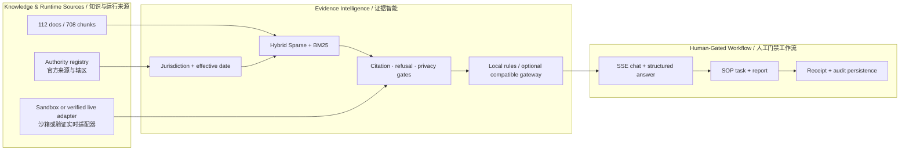

<table>
  <tr>
    <td width="64%" valign="middle">
      <p><code>MARITIME RAG · EVIDENCE GOVERNANCE · SOP COPILOT</code></p>
      <h1>小懿 AI · 港航行业智能问答与SOP决策助手</h1>
      <h3>Xiaoyi AI · Evidence-Grounded Maritime RAG &amp; Operations Copilot</h3>
      <p><strong>把港航问答从“模型说了什么”，提升为“证据来自哪里、适用于哪个辖区和日期、何时必须拒答、谁允许推进任务”的可审计决策链。</strong></p>
      <p><em>A governance-first maritime assistant where retrieval, jurisdiction, temporal applicability, refusal, task progression, and audit evidence are independently reviewable.</em></p>
      <p><strong>112</strong> 登记文档 · <strong>708</strong> 知识分块 · <strong>60</strong> 官方来源 · <strong>11/11</strong> 证据策略门禁</p>
    </td>
    <td width="36%" align="center">
      
    </td>
  </tr>
</table>

<p align="center">
  <a href="https://github.com/wenjiayi123/xiaoyi-maritime-ai/actions/workflows/ci.yml"></a>
  <a href="LICENSE"></a>
  
  
  
  
  
</p>

<p align="center">
  <a href="#核心证明数据--headline-evidence">核心指标</a> ·
  <a href="#能力全景--capability-map">能力全景</a> ·
  <a href="#系统架构--architecture">系统架构</a> ·
  <a href="#快速运行--quick-start">快速运行</a> ·
  <a href="reports/maritime_rag_benchmark_v1.md">基准报告</a> ·
  <a href="docs/OPEN_SOURCE_READINESS.md">开源审计</a>
</p>

---

## 核心证明数据 / Headline evidence

| 证据维度 / Evidence dimension | 固定结果 / Pinned result | 可复验入口 / Verification entry |
|---|---:|---|
| 知识快照 / Knowledge snapshot | **112**份文档、**708**个分块、**60**份官方核验来源 | `data/xiaoyi_index.json` + `data/source_registry.json` |
| 固定测试 / Fixed release acceptance | **35**题：24题检索 + 11题证据策略 | `data/evaluation/maritime_qa_benchmark_v1.json` |
| Hybrid检索 / Hybrid retrieval | Hit@1/3/5 = **87.50% / 100% / 100%** | `reports/maritime_rag_benchmark_v1.json` |
| 同快照对照 / Same-snapshot baseline | MRR **0.8507 → 0.9236**（+7.29个百分点） | Hybrid Sparse vs BM25-only |
| 证据治理 / Evidence governance | 官方来源、Top-5纯度、双哈希完整率均 **100%** | SHA-256固定索引、来源与核心策略代码 |
| 安全策略 / Safety policy | 拒答、辖区、日期、实时数据边界 **11/11通过** | `python scripts/run_rag_benchmark.py verify --deep` |

> [!NOTE]
> 这些数字来自仓库固定发布验收集，不是第三方用户研究、生产SLA、法律意见或全球知识覆盖率。小懿默认将“公开/整理知识”“运营沙箱”“授权实时接口”和“生产动作权限”分开标识。

## 能力全景 / Capability map

| 能力平面 / Plane | 已实现 / Implemented | 工程边界 / Guardrail |
|---|---|---|
| 港航RAG / Maritime RAG | Hybrid Sparse + BM25对照、来源路由、证据融合、结构化引用 | 无匹配证据时拒答，不补造条款 |
| 法规治理 / Regulatory governance | 辖区、施行日期、官方来源要求、全文版权边界 | 回答不替代主管机关或法律意见 |
| SOP决策 / SOP decision support | 告警解释、对象追问、步骤任务、报告生成 | 高风险任务强制 `requires_human_confirmation` |
| 运营沙箱 / Operations sandbox | 船舶、泊位、设备、能耗、预警与任务API | 未验证网关显示“等待接入港口”，不冒充生产实绩 |
| RL实验室 / RL laboratory | Q-learning、SARSA、Expected SARSA、Double Q + PID | 公开UCI时序基准，不宣称港口现场收益 |
| 平台工程 / Platform engineering | FastAPI、SSE、JWT/RBAC、SQLite、幂等、限流、审计 | 外部模型调用受隐私、证据和角色门禁约束 |
| 可观测性 / Observability | readiness、Prometheus、JSON日志、请求追踪、熔断 | 未配置依赖失败关闭并返回可诊断状态 |

## 系统架构 / Architecture



<p align="center">
  
</p>

## 项目结构 / Repository map

```text
小懿AI/
  app/
    main.py              # FastAPI 服务入口
    operations.py        # 运营看板、任务执行与结构化报告 API
    port_runtime.py      # 沙箱/生产可替换数据适配器
    rl_lab/              # 数据契约、环境、4种RL、PID、后台训练与评估API
    operator_assistant.py # 一线口语、对象追问和岗位快捷问法
    xiaoyi.py            # 小懿回答引擎
    retrieval.py         # Hybrid Sparse 与 BM25 对照检索
    prompts.py           # 港航专业提示词
    models.py            # 请求与响应模型
    config.py            # 路径与配置
  data/
    kb/                  # 港航基础知识库
    evaluation/          # 固定港航检索与证据安全评测集
    public/              # 公开RL基准数据与血缘记录
    rl_datasets.json     # 公开与站点数据集目录
    xiaoyi_index.json    # 构建后的检索索引
  scripts/
    build_index.py       # 知识库索引构建脚本
    fetch_public_rl_dataset.py # 固定来源下载并校验公开RL数据
    run_rag_benchmark.py # 运行/验证固定RAG基准并生成带哈希报告
  web/
    index.html           # Web 交互页面
  tests/
    test_retrieval.py    # 基础验证
    test_operations_api.py # 运营 API 与兼容性回归
```

## 快速运行 / Quick start

推荐直接使用项目启动脚本；首次运行会创建 `.venv`、安装运行依赖、重建索引并启动服务：

```bash
cd <xiaoyi-ai-repository>
bash run.sh
```

也可以手动运行：

```bash
cd <xiaoyi-ai-repository>
python3 -m venv .venv
source .venv/bin/activate
pip install -r requirements.lock
python scripts/build_index.py
uvicorn app.main:app --reload --port 8010
```

打开：

```text
http://127.0.0.1:8010
```

## 命令行测试

```bash
cd <xiaoyi-ai-repository>
python -m app.cli "岸电 THDi 超标告警应该先检查什么？"
python -m app.cli "小懿的核心能力是什么？" --mode expert
```

## 系统说明

小懿是面向港航场景的小型 AI 助手。它采用本地港航知识库和 RAG 检索，结合专业问答、SOP 生成、告警解释和运营建议。默认 `local_rules` 生成路径不依赖外部模型；也可显式配置 OpenAI-compatible 模型网关。只有已通过证据门禁、不含沙箱运营数据且完成外发授权的回答才允许发往外部模型；其他情况保留本地严格证据答案。

运营看板默认使用后端持续生成的运营沙箱事件流。它具有生产形态的业务对象、时间戳、质量码、延迟和来源适配器，但明确标记为非生产实绩。切换生产时保持 `port-ops.v1` 契约并配置只读数据网关；高风险任务仍返回 `requires_human_confirmation: true`，不会因接入真实数据自动获得写权限。

## 港口运营数据 API

```text
GET  /api/dashboard                 聚合运营概况、能耗、预警和快捷任务
GET  /api/runtime/status            数据模式、来源、质量、延迟与生产边界
GET  /api/runtime/snapshot          船舶、泊位、设备、堆场和闸口业务对象
GET  /api/operations/overview       实时运营概况
GET  /api/energy?range=today        能耗与碳排趋势（today / 7d / 30d）
GET  /api/alerts                    预警列表，可按 level/status 筛选
GET  /api/tasks/templates           可执行任务模板
POST /api/tasks                     创建运营沙箱任务
POST /api/tasks/{task_id}/next      完成当前步骤并推进到下一步
POST /api/reports                   生成结构化运营报告
GET  /api/reports/{report_id}       获取已生成报告
GET  /api/operator/scenarios        一线岗位快捷问法与安全边界
```

生产数据切换说明见 [港口运营数据适配器](docs/PORT_OPERATIONS_DATA_ADAPTER.md)。默认无需配置；接生产网关时设置 `XIAOYI_PORT_DATA_MODE=live`、`XIAOYI_PORT_BASE_URL` 和可选只读令牌即可。网关未返回 `live_data_verified=true` 或版本不是 `port-ops.v1` 时，服务会失败关闭，绝不把数据冒充生产实绩。

运行测试：

```bash
python -m pip install -r requirements-dev.lock
pytest -q
```

## 安全、持久化与运维

本地模式仅用于回环开发。生产模式必须使用签名 JWT、显式主机名和 CORS 来源，否则服务拒绝启动。对话、任务、报告、自动化计划、反馈与审计保存在 SQLite；中断工作在重启后会安全标记为失败或取消，不会无声续跑。

```text
GET  /health/live               进程存活
GET  /health/ready              存储、索引、RL数据、模型和部署配置深度就绪
GET  /metrics                   Prometheus指标（生产应限制到监控网络）
GET  /api/system/info           当前安全与运维能力
GET  /api/models                模型配置、回退与熔断状态
GET  /api/conversations/{id}    当前身份的持久对话历史
POST /api/chat/stream           服务端事件流式回答
```

部署、TLS/SSO、密钥、备份、模型数据外发和多实例边界见 [部署指南](docs/DEPLOYMENT.md)；信任边界见 [系统架构](docs/ARCHITECTURE.md)；开源审计结论见 [真实性与工程化评估](docs/OPEN_SOURCE_READINESS.md)。

## 当前适合问的问题

完整分类问题库见：[小懿可询问问题库](小懿可询问问题库/00_问题库使用说明.md)。其中已区分当前运营沙箱、知识库问答和生产系统接入后实时问题。

## 可复现 RL 训练实验室

RL板块不再回放其他项目的历史训练曲线。当前实现会在后台真实执行
Q-learning、SARSA、Expected SARSA 和 Double Q-learning，并用 PID 作为控制
理论基线。训练百分比来自已完成 episode 数，模型按算法保存并计算 SHA-256。

默认数据为 UCI Appliances Energy Prediction 的 19,735 条真实十分钟级能源与
气象观测（CC BY 4.0，DOI `10.24432/C5VC8G`）。它是公开算法基准，不是港口
实绩。数据按时间切成训练/验证/保留测试段；训练强制不渲染，训练全部结束后
测试接口才生成轨迹。

```bash
# 数据随仓库提供；也可以从固定UCI来源重新生成并核验
.venv/bin/python scripts/fetch_public_rl_dataset.py

# 运行全部测试
.venv/bin/python -m pytest -q
```

接口：

```text
GET  /api/rl-lab/health
GET  /api/rl-lab/algorithms
GET  /api/rl-lab/datasets
POST /api/rl-lab/runs
GET  /api/rl-lab/runs/{run_id}
POST /api/rl-lab/runs/{run_id}/cancel
POST /api/rl-lab/runs/{run_id}/evaluate
```

接入港口时提供至少包含 `timestamp,load_kw` 的CSV并设置
`XIAOYI_RL_DATASET_PATH`；可选接入电价、碳强度和气象列，不需要修改训练器。
完整说明见[可复现RL能源调度实验室](docs/RL_AGV_ENERGY_MISSION_GUIDE.md)。

- 港口由哪些核心业务模块组成？
- 集装箱码头从船舶靠泊到离港的流程是什么？
- TOS 系统在港口运营里负责什么？
- 岸电 THDi 超标告警应该先检查什么？
- 台风红色预警下港区要启动哪些安全流程？
- 港口碳排放盘查需要保留哪些证据？
- 小懿的系统架构是什么？

## 真实港口连接器（待站点联调）

项目已预留 TOS、PCS、EMS、EAM、VTS、AIS、气象海洋和国际贸易单一窗口连接器契约，但默认全部离线，未配置任何真实端点或凭据。安全配置、站点联调、写操作门禁、回滚和审计要求见 [港口连接器接入手册](docs/PORT_CONNECTOR_INTEGRATION.md)，环境变量模板见 [`.env.connectors.example`](.env.connectors.example)。

```text
GET  /api/connectors                              连接器目录与状态
GET  /api/connectors/{id}/field-mappings          字段映射模板
POST /api/connectors/{id}/health-check            执行真实健康探测
POST /api/connectors/{id}/write-preflight         写操作预检（不执行下发）
```

## 智能操作与可审计知识库

```text
POST /api/automation/plans                       将自然语言解析为白名单界面步骤
POST /api/automation/plans/{id}/next             回写当前步骤结果并推进计划
POST /api/automation/plans/{id}/confirm          绑定当前动作的人工确认或拒绝
GET  /api/knowledge/status                       文档、片段、官方来源与索引哈希
GET  /api/knowledge/catalog                      24 大类 / 96 主题的专业资料覆盖路线图
GET  /api/knowledge/authority-coverage           权威来源族、已覆盖、缺口与许可隔离矩阵
POST /api/knowledge/search                       检索正文索引并返回来源与双 SHA-256
GET  /api/knowledge/sources                      查看来源登记与验证等级
POST /api/knowledge/intake                       暂存待人工审核资料，不进入正式索引
```

专业资料全目录与当前覆盖状态见 [港航专业知识总目录](docs/PORT_MARITIME_KNOWLEDGE_CATALOG.md)；知识来源分级、资料审核、发布、索引重建与拒答边界见 [知识库治理说明](docs/KNOWLEDGE_GOVERNANCE.md)。

一线调度、值班、设备、闸口、堆场和交接班人员的完整使用流程见 [一线操作人员系统指南](docs/XIAOYI_FRONTLINE_OPERATOR_SYSTEM_GUIDE.md)。

## 小懿智能联动中心（7项能力）

小懿只承担港航知识、RAG、上下文识别、能力路由、结果解释和审计，不复制能碳驾驶舱、数字孪生平台、马六甲沙盘或航行模拟器的业务功能。跨系统能力默认 `offline`，不访问其他系统；dry-run 只检查契约，显式配置为 `live` 后也只允许登记的 GET 只读能力。

```text
GET  /api/hub/systems                            四个内部系统能力目录
GET  /api/hub/capabilities                       只读能力清单
POST /api/hub/capabilities/{id}/invoke           隔离预览或授权只读调用
POST /api/context/resolve                        统一港航业务上下文
POST /api/evidence/fuse                          知识/系统/推演证据融合
POST /api/orchestrator/run                       自然语言跨系统编排
GET  /api/governance/audit                       SQLite 持久审计
POST /api/evaluation/run                         固定 RAG 回归评测
POST /api/evaluation/feedback                    提交人工反馈
POST /api/evaluation/feedback/{id}/review        审核后转入知识待审核区
```

网页左侧点击“智能联动中心”即可查看 7/7 完成度、系统能力注册表、跨系统安全预览、RAG 评测和反馈闭环。完整验证步骤见 [智能联动中心说明](docs/XIAOYI_INTELLIGENCE_HUB.md)。

## 可复现港航 RAG 与证据安全基准

仓库提供 60 题固定版本评测集：40 题检索、20 题证据策略；其中 35
题构成 v1 固定测试分区。当前知识快照为 112 份文档、708 个分块和 60
份官方核验来源。测试分区的 24 个检索题上，Hybrid Sparse 的
Hit@1/3/5 为 87.50%/100%/100%，BM25-only 为
75.00%/95.83%/100%；Hybrid 在首位命中率上提升 12.50 个百分点，
MRR 为 0.9236 对 0.8507（+7.29 个百分点）。Hit@5 同为 100%，不把
已经饱和的 Top-5 指标包装成提升。
11 个策略测试覆盖条款级拒答、无依据回答阻断、辖区路由、法规日期切换和
实时数据边界，当前为 11/11。

```bash
# 快速核对报告所绑定的数据、索引和核心代码哈希
.venv/bin/python scripts/run_rag_benchmark.py verify

# 完整重跑全部60题并比对确定性结果，单核环境可能需要数分钟
.venv/bin/python scripts/run_rag_benchmark.py verify --deep

# 重新生成报告
.venv/bin/python scripts/run_rag_benchmark.py run
```

固定题集、[JSON证据报告](reports/maritime_rag_benchmark_v1.json)和
[可读报告](reports/maritime_rag_benchmark_v1.md)随仓库发布。该测试分区用于
v1 发布验收，并在工程修复中暴露过缺陷，因此不是“从未查看的独立留出集”；
题目由项目维护，也不是第三方用户研究。上述数字是仓库基准上的检索与安全
指标，不是港口生产收益、全球知识覆盖率、法律意见或线上 SLA。

简历可用声明与禁用表述见 [简历指标口径](docs/RESUME_CLAIMS.md)。
