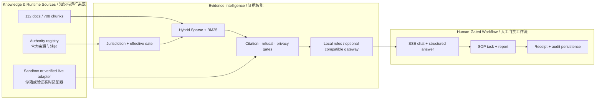
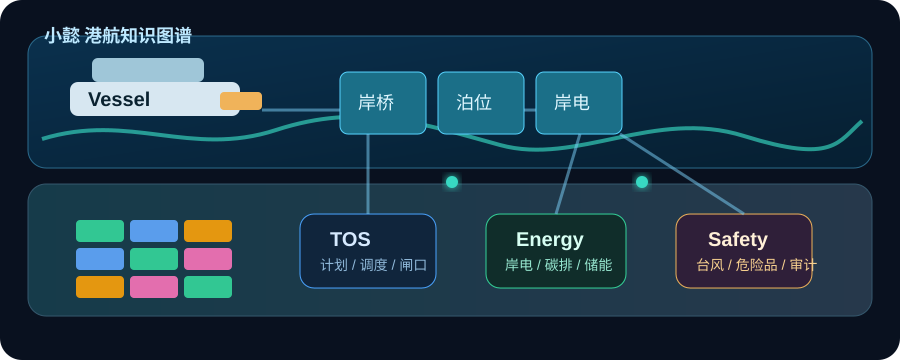

<table>
  <tr>
    <td width="64%" valign="middle">
      <p><code>MARITIME RAG · EVIDENCE GOVERNANCE · SOP COPILOT</code></p>
      <h1>小懿 AI · 港航行业智能问答与SOP决策助手</h1>
      <h3>Xiaoyi AI · Evidence-Grounded Maritime RAG &amp; Operations Copilot</h3>
      <p><strong>把港航问答从“模型说了什么”，提升为“证据来自哪里、适用于哪个辖区和日期、何时必须拒答、谁允许推进任务”的可审计决策链。</strong></p>
      <p><em>A governance-first maritime assistant where retrieval, jurisdiction, temporal applicability, refusal, task progression, and audit evidence are independently reviewable.</em></p>
      <p><strong>112</strong> 登记文档 · <strong>708</strong> 知识分块 · <strong>60</strong> 官方来源 · <strong>11/11</strong> 证据策略门禁</p>
    </td>
    <td width="36%" align="center">
      
    </td>
  </tr>
</table>

<p align="center">
  <a href="https://github.com/wenjiayi123/xiaoyi-maritime-ai/actions/workflows/ci.yml"></a>
  <a href="LICENSE"></a>
  
  
  
  
  
</p>

<p align="center">
  <a href="#核心证明数据--headline-evidence">核心指标 / Evidence</a> ·
  <a href="#能力全景--capability-map">能力全景 / Capabilities</a> ·
  <a href="#系统架构--architecture">系统架构 / Architecture</a> ·
  <a href="#快速运行--quick-start">快速运行 / Quick start</a> ·
  <a href="reports/maritime_rag_benchmark_v1.md">基准报告 / Benchmark</a> ·
  <a href="docs/OPEN_SOURCE_READINESS.md">开源审计 / Audit</a>
</p>

---

## 核心证明数据 / Headline evidence

| 证据维度 / Evidence dimension | 固定结果 / Pinned result | 可复验入口 / Verification entry |
|---|---:|---|
| 知识快照 / Knowledge snapshot | **112**份文档、**708**个分块、**60**份官方核验来源<br><sub>**112** documents, **708** chunks, **60** officially verified sources</sub> | `data/xiaoyi_index.json` + `data/source_registry.json` |
| 固定测试 / Fixed release acceptance | **35**题：24题检索 + 11题证据策略<br><sub>**35** tests: 24 retrieval + 11 evidence-policy cases</sub> | `data/evaluation/maritime_qa_benchmark_v1.json` |
| Hybrid检索 / Hybrid retrieval | Hit@1/3/5 = **87.50% / 100% / 100%** | `reports/maritime_rag_benchmark_v1.json` |
| 同快照对照 / Same-snapshot baseline | MRR **0.8507 → 0.9236**（+7.29个百分点 / pp） | Hybrid Sparse vs BM25-only |
| 证据治理 / Evidence governance | 官方来源、Top-5纯度、双哈希完整率均 **100%**<br><sub>Official-source rate, Top-5 purity, and dual-hash integrity all **100%**</sub> | SHA-256固定索引、来源与核心策略代码<br><sub>SHA-256-pinned index, source registry, and policy code</sub> |
| 安全策略 / Safety policy | 拒答、辖区、日期、实时数据边界 **11/11通过**<br><sub>Refusal, jurisdiction, date, and live-data boundaries: **11/11 passed**</sub> | `python scripts/run_rag_benchmark.py verify --deep` |

> [!NOTE]
> 这些数字来自仓库固定发布验收集，不是第三方用户研究、生产SLA、法律意见或全球知识覆盖率。小懿默认将“公开/整理知识”“运营沙箱”“授权实时接口”和“生产动作权限”分开标识。
>
> These figures come from the repository’s pinned release-acceptance set—not a third-party user study, production SLA, legal opinion, or global knowledge-coverage estimate. Xiaoyi explicitly separates curated public knowledge, the operations sandbox, authorized live interfaces, and production-action authority.

## 能力全景 / Capability map

| 能力平面 / Plane | 已实现 / Implemented | 工程边界 / Guardrail |
|---|---|---|
| 港航RAG / Maritime RAG | Hybrid Sparse + BM25对照、来源路由、证据融合、结构化引用<br><sub>Hybrid Sparse with BM25 baseline, source routing, evidence fusion, structured citations</sub> | 无匹配证据时拒答，不补造条款<br><sub>Refuses without matching evidence; never invents clauses</sub> |
| 法规治理 / Regulatory governance | 辖区、施行日期、官方来源要求、全文版权边界<br><sub>Jurisdiction, effective date, official-source requirement, copyright boundary</sub> | 回答不替代主管机关或法律意见<br><sub>Answers do not replace authorities or legal advice</sub> |
| SOP决策 / SOP decision support | 告警解释、对象追问、步骤任务、报告生成<br><sub>Alert explanation, entity clarification, stepwise tasks, reports</sub> | 高风险任务强制 `requires_human_confirmation`<br><sub>High-risk tasks force `requires_human_confirmation`</sub> |
| 运营沙箱 / Operations sandbox | 船舶、泊位、设备、能耗、预警与任务API<br><sub>Vessel, berth, equipment, energy, alert, and task APIs</sub> | 未验证网关显示“等待接入港口”，不冒充生产实绩<br><sub>Unverified gateways display “awaiting port connection,” never production performance</sub> |
| RL实验室 / RL laboratory | Q-learning、SARSA、Expected SARSA、Double Q + PID | 公开UCI时序基准，不宣称港口现场收益<br><sub>Public UCI time-series benchmark; no site-benefit claim</sub> |
| 平台工程 / Platform engineering | FastAPI、SSE、JWT/RBAC、SQLite、幂等、限流、审计<br><sub>FastAPI, SSE, JWT/RBAC, SQLite, idempotency, rate limits, audit</sub> | 外部模型调用受隐私、证据和角色门禁约束<br><sub>External model calls are privacy-, evidence-, and role-gated</sub> |
| 可观测性 / Observability | readiness、Prometheus、JSON日志、请求追踪、熔断<br><sub>Readiness, Prometheus, JSON logs, request tracing, circuit breaker</sub> | 未配置依赖失败关闭并返回可诊断状态<br><sub>Unconfigured dependencies fail closed with diagnosable status</sub> |

## 系统架构 / Architecture



<p align="center">
  
</p>

## 项目结构 / Repository map

```text
小懿AI/
  app/
    main.py              # FastAPI服务入口 / service entry
    operations.py        # 运营、任务与报告API / operations, tasks, reports
    port_runtime.py      # 沙箱/生产数据适配器 / sandbox/live adapters
    rl_lab/              # 数据、4种RL、PID与评估 / data, 4 RL, PID, evaluation
    operator_assistant.py # 一线口语与对象追问 / frontline language and clarification
    xiaoyi.py            # 小懿回答引擎 / answer engine
    retrieval.py         # Hybrid Sparse与BM25对照 / retrieval and baseline
    prompts.py           # 港航专业提示词 / maritime prompts
    models.py            # 请求与响应模型 / request-response models
    config.py            # 路径与配置 / paths and configuration
  data/
    kb/                  # 港航知识库 / maritime knowledge base
    evaluation/          # 固定检索与证据评测 / pinned retrieval and policy set
    public/              # 公开RL数据与血缘 / public RL data and provenance
    rl_datasets.json     # 数据集目录 / dataset registry
    xiaoyi_index.json    # 检索索引 / retrieval index
  scripts/
    build_index.py       # 构建知识索引 / build knowledge index
    fetch_public_rl_dataset.py # 下载并校验公开RL数据 / fetch and verify
    run_rag_benchmark.py # 固定RAG基准与哈希报告 / benchmark and hash report
  web/
    index.html           # Web交互页面 / Web interface
  tests/
    test_retrieval.py    # 检索验证 / retrieval verification
    test_operations_api.py # 运营API与回归 / operations API and regression
```

## 快速运行 / Quick start

推荐直接使用项目启动脚本；首次运行会创建 `.venv`、安装运行依赖、重建索引并启动服务：<br>
Use the project launcher. On first run it creates `.venv`, installs runtime dependencies, rebuilds the index, and starts the service:

```bash
cd <xiaoyi-ai-repository>
bash run.sh
```

也可以手动运行：<br>
Or run manually:

```bash
cd <xiaoyi-ai-repository>
python3 -m venv .venv
source .venv/bin/activate
pip install -r requirements.lock
python scripts/build_index.py
uvicorn app.main:app --reload --port 8010
```

打开：<br>
Open:

```text
http://127.0.0.1:8010
```

## 命令行测试 / Command-line queries

```bash
cd <xiaoyi-ai-repository>
python -m app.cli "岸电 THDi 超标告警应该先检查什么？"
python -m app.cli "小懿的核心能力是什么？" --mode expert
```

## 系统说明 / System behavior

小懿是面向港航场景的小型 AI 助手。它采用本地港航知识库和 RAG 检索，结合专业问答、SOP 生成、告警解释和运营建议。默认 `local_rules` 生成路径不依赖外部模型；也可显式配置 OpenAI-compatible 模型网关。只有已通过证据门禁、不含沙箱运营数据且完成外发授权的回答才允许发往外部模型；其他情况保留本地严格证据答案。

Xiaoyi is a compact AI assistant for maritime and port operations. It combines a local maritime knowledge base and RAG retrieval with professional Q&A, SOP generation, alert explanation, and operational guidance. The default `local_rules` path does not depend on an external model; an OpenAI-compatible gateway can be configured explicitly. Only answers that pass the evidence gate, contain no sandbox operational data, and receive outbound authorization may reach an external model; all other cases retain the local strict-evidence answer.

运营看板默认使用后端持续生成的运营沙箱事件流。它具有生产形态的业务对象、时间戳、质量码、延迟和来源适配器，但明确标记为非生产实绩。切换生产时保持 `port-ops.v1` 契约并配置只读数据网关；高风险任务仍返回 `requires_human_confirmation: true`，不会因接入真实数据自动获得写权限。

The operations dashboard consumes a continuously generated backend sandbox event stream. It uses production-shaped entities, timestamps, quality codes, latency, and source adapters while remaining explicitly labelled non-production. A live integration retains the `port-ops.v1` contract and a read-only gateway. High-risk tasks still return `requires_human_confirmation: true`; real data never grants write authority automatically.

## 港口运营数据 API / Port-operations API

```text
GET  /api/dashboard                 聚合概况、能耗、预警、任务 / aggregate operations, energy, alerts, tasks
GET  /api/runtime/status            模式、来源、质量与边界 / mode, provenance, quality, boundary
GET  /api/runtime/snapshot          船舶、泊位、设备等对象 / vessels, berths, equipment, yard, gates
GET  /api/operations/overview       运营概况 / operations overview
GET  /api/energy?range=today        能碳趋势 / energy-carbon trend (today / 7d / 30d)
GET  /api/alerts                    预警筛选 / alerts filtered by level/status
GET  /api/tasks/templates           任务模板 / executable task templates
POST /api/tasks                     创建沙箱任务 / create sandbox task
POST /api/tasks/{task_id}/next      推进任务步骤 / advance current step
POST /api/reports                   生成结构化报告 / generate structured report
GET  /api/reports/{report_id}       获取报告 / retrieve report
GET  /api/operator/scenarios        岗位问法与安全边界 / frontline prompts and safety limits
```

生产数据切换说明见 [港口运营数据适配器](docs/PORT_OPERATIONS_DATA_ADAPTER.md)。默认无需配置；接生产网关时设置 `XIAOYI_PORT_DATA_MODE=live`、`XIAOYI_PORT_BASE_URL` 和可选只读令牌即可。网关未返回 `live_data_verified=true` 或版本不是 `port-ops.v1` 时，服务会失败关闭，绝不把数据冒充生产实绩。

See the [port-operations data adapter](docs/PORT_OPERATIONS_DATA_ADAPTER.md) for live-data switching. No configuration is needed by default. For a production gateway, set `XIAOYI_PORT_DATA_MODE=live`, `XIAOYI_PORT_BASE_URL`, and an optional read-only token. The service fails closed unless the gateway returns `live_data_verified=true` and contract version `port-ops.v1`; unverified data is never presented as production performance.

运行测试：<br>
Run tests:

```bash
python -m pip install -r requirements-dev.lock
pytest -q
```

## 安全、持久化与运维 / Security, persistence, and operations

本地模式仅用于回环开发。生产模式必须使用签名 JWT、显式主机名和 CORS 来源，否则服务拒绝启动。对话、任务、报告、自动化计划、反馈与审计保存在 SQLite；中断工作在重启后会安全标记为失败或取消，不会无声续跑。

Local mode is for loopback development only. Production requires signed JWTs, explicit hostnames, and CORS origins or the service refuses to start. Conversations, tasks, reports, automation plans, feedback, and audit evidence persist in SQLite. Interrupted work is safely marked failed or cancelled after restart rather than resuming silently.

```text
GET  /health/live               进程存活 / process liveness
GET  /health/ready              深度就绪 / storage, index, RL, model, deployment readiness
GET  /metrics                   Prometheus指标 / metrics; restrict in production
GET  /api/system/info           安全与运维能力 / security and operations capability
GET  /api/models                模型、回退与熔断 / models, fallback, circuit breaker
GET  /api/conversations/{id}    持久对话 / identity-scoped conversation history
POST /api/chat/stream           SSE流式回答 / server-sent-event answer stream
```

部署、TLS/SSO、密钥、备份、模型数据外发和多实例边界见 [部署指南](docs/DEPLOYMENT.md)；信任边界见 [系统架构](docs/ARCHITECTURE.md)；开源审计结论见 [真实性与工程化评估](docs/OPEN_SOURCE_READINESS.md)。

See the [deployment guide](docs/DEPLOYMENT.md) for TLS/SSO, secrets, backups, model-data egress, and multi-instance boundaries; [architecture](docs/ARCHITECTURE.md) for trust boundaries; and [open-source readiness](docs/OPEN_SOURCE_READINESS.md) for the engineering audit.

## 当前适合问的问题 / Suitable questions

完整分类问题库见：[小懿可询问问题库](小懿可询问问题库/00_问题库使用说明.md)。其中已区分当前运营沙箱、知识库问答和生产系统接入后实时问题。

See the [categorized question library](小懿可询问问题库/00_问题库使用说明.md), which separates current sandbox questions, knowledge-base questions, and questions that require a verified live production connection.

## 可复现 RL 训练实验室 / Reproducible RL laboratory

RL板块不再回放其他项目的历史训练曲线。当前实现会在后台真实执行
Q-learning、SARSA、Expected SARSA 和 Double Q-learning，并用 PID 作为控制
理论基线。训练百分比来自已完成 episode 数，模型按算法保存并计算 SHA-256。

默认数据为 UCI Appliances Energy Prediction 的 19,735 条真实十分钟级能源与
气象观测（CC BY 4.0，DOI `10.24432/C5VC8G`）。它是公开算法基准，不是港口
实绩。数据按时间切成训练/验证/保留测试段；训练强制不渲染，训练全部结束后
测试接口才生成轨迹。

The RL panel no longer replays historical curves from another project. It runs Q-learning, SARSA, Expected SARSA, and Double Q-learning in a real background worker, with PID as the control-theory baseline. Progress is derived from completed episodes; each algorithm artifact is saved and SHA-256 hashed.

The default dataset contains 19,735 genuine ten-minute energy and weather observations from the UCI Appliances Energy Prediction dataset (CC BY 4.0, DOI `10.24432/C5VC8G`). It is a public algorithm benchmark, not port performance. Data is split chronologically into train, validation, and sealed test segments. Training is forced headless, and only the post-training evaluation endpoint creates trajectories.

```bash
# 仓库已带数据；可从UCI重建 / bundled data; optionally rebuild from pinned UCI source
.venv/bin/python scripts/fetch_public_rl_dataset.py

# 运行全部测试 / run all tests
.venv/bin/python -m pytest -q
```

接口：

```text
GET  /api/rl-lab/health
GET  /api/rl-lab/algorithms
GET  /api/rl-lab/datasets
POST /api/rl-lab/runs
GET  /api/rl-lab/runs/{run_id}
POST /api/rl-lab/runs/{run_id}/cancel
POST /api/rl-lab/runs/{run_id}/evaluate
```

接入港口时提供至少包含 `timestamp,load_kw` 的CSV并设置
`XIAOYI_RL_DATASET_PATH`；可选接入电价、碳强度和气象列，不需要修改训练器。
完整说明见[可复现RL能源调度实验室](docs/RL_AGV_ENERGY_MISSION_GUIDE.md)。

For a port dataset, provide a CSV containing at least `timestamp,load_kw` and set `XIAOYI_RL_DATASET_PATH`. Price, carbon-intensity, and weather columns are optional, and the trainer does not need modification. See the [reproducible RL energy-dispatch laboratory](docs/RL_AGV_ENERGY_MISSION_GUIDE.md).

- 港口由哪些核心业务模块组成？ / What are the core operating domains of a port?
- 集装箱码头从船舶靠泊到离港的流程是什么？ / What is the container-terminal workflow from berthing to departure?
- TOS 系统在港口运营里负责什么？ / What does a TOS manage in port operations?
- 岸电 THDi 超标告警应该先检查什么？ / What should be checked first after a shore-power THDi alarm?
- 台风红色预警下港区要启动哪些安全流程？ / Which safety procedures apply under a red typhoon warning?
- 港口碳排放盘查需要保留哪些证据？ / What evidence must be retained for a port carbon inventory?
- 小懿的系统架构是什么？ / What is Xiaoyi’s system architecture?

## 真实港口连接器（待站点联调）/ Live-port connectors (site integration pending)

项目已预留 TOS、PCS、EMS、EAM、VTS、AIS、气象海洋和国际贸易单一窗口连接器契约，但默认全部离线，未配置任何真实端点或凭据。安全配置、站点联调、写操作门禁、回滚和审计要求见 [港口连接器接入手册](docs/PORT_CONNECTOR_INTEGRATION.md)，环境变量模板见 [`.env.connectors.example`](.env.connectors.example)。

The project defines connector contracts for TOS, PCS, EMS, EAM, VTS, AIS, metocean services, and maritime single windows. All are offline by default, with no real endpoint or credential bundled. See the [port-connector integration manual](docs/PORT_CONNECTOR_INTEGRATION.md) for secure configuration, site commissioning, write gates, rollback, and audit requirements, and [`.env.connectors.example`](.env.connectors.example) for environment templates.

```text
GET  /api/connectors                              目录与状态 / catalogue and status
GET  /api/connectors/{id}/field-mappings          字段映射 / field-mapping template
POST /api/connectors/{id}/health-check            真实健康探测 / real health probe
POST /api/connectors/{id}/write-preflight         写预检，不下发 / write preflight; no dispatch
```

## 智能操作与可审计知识库 / Intelligent operations and auditable knowledge

```text
POST /api/automation/plans                       自然语言转白名单步骤 / language-to-allowlisted steps
POST /api/automation/plans/{id}/next             回写并推进 / record result and advance
POST /api/automation/plans/{id}/confirm          人工确认或拒绝 / bind human approval or rejection
GET  /api/knowledge/status                       文档、来源与索引哈希 / docs, sources, index hashes
GET  /api/knowledge/catalog                      24类/96主题路线图 / 24-domain, 96-topic roadmap
GET  /api/knowledge/authority-coverage           权威覆盖与缺口 / authority coverage and gaps
POST /api/knowledge/search                       来源与双SHA-256检索 / search with source and dual hashes
GET  /api/knowledge/sources                      来源登记与等级 / source registry and verification level
POST /api/knowledge/intake                       待审资料暂存 / stage material for human review
```

专业资料全目录与当前覆盖状态见 [港航专业知识总目录](docs/PORT_MARITIME_KNOWLEDGE_CATALOG.md)；知识来源分级、资料审核、发布、索引重建与拒答边界见 [知识库治理说明](docs/KNOWLEDGE_GOVERNANCE.md)。

一线调度、值班、设备、闸口、堆场和交接班人员的完整使用流程见 [一线操作人员系统指南](docs/XIAOYI_FRONTLINE_OPERATOR_SYSTEM_GUIDE.md)。

See the [maritime knowledge catalogue](docs/PORT_MARITIME_KNOWLEDGE_CATALOG.md) for current coverage and the [knowledge-governance guide](docs/KNOWLEDGE_GOVERNANCE.md) for source tiers, review, publication, index rebuilds, and refusal boundaries. The [frontline operator guide](docs/XIAOYI_FRONTLINE_OPERATOR_SYSTEM_GUIDE.md) covers dispatchers, duty teams, equipment, gates, yard personnel, and shift handover.

## 小懿智能联动中心（7项能力）/ Xiaoyi intelligence hub (7 capabilities)

小懿只承担港航知识、RAG、上下文识别、能力路由、结果解释和审计，不复制能碳驾驶舱、数字孪生平台、马六甲沙盘或航行模拟器的业务功能。跨系统能力默认 `offline`，不访问其他系统；dry-run 只检查契约，显式配置为 `live` 后也只允许登记的 GET 只读能力。

Xiaoyi owns maritime knowledge, RAG, context resolution, capability routing, result explanation, and audit. It does not duplicate the CarbonOps cockpit, digital-twin platform, Malacca sandbox, or sailing simulator. Cross-system capabilities default to `offline`; dry-run verifies only contracts, and even explicit `live` mode permits registered read-only GET capabilities only.

```text
GET  /api/hub/systems                            四系统目录 / four-system catalogue
GET  /api/hub/capabilities                       只读能力 / read-only capabilities
POST /api/hub/capabilities/{id}/invoke           隔离预览或授权只读 / isolated preview or approved read
POST /api/context/resolve                        统一业务上下文 / unified business context
POST /api/evidence/fuse                          证据融合 / knowledge-system-simulation fusion
POST /api/orchestrator/run                       跨系统编排 / natural-language orchestration
GET  /api/governance/audit                       SQLite持久审计 / persistent audit
POST /api/evaluation/run                         固定RAG回归 / pinned RAG regression
POST /api/evaluation/feedback                    人工反馈 / human feedback
POST /api/evaluation/feedback/{id}/review        审核入待审区 / reviewed intake staging
```

网页左侧点击“智能联动中心”即可查看 7/7 完成度、系统能力注册表、跨系统安全预览、RAG 评测和反馈闭环。完整验证步骤见 [智能联动中心说明](docs/XIAOYI_INTELLIGENCE_HUB.md)。

Open “智能联动中心 / Intelligence Hub” from the left navigation to inspect 7/7 capability status, the system registry, safe cross-system previews, RAG evaluation, and the feedback loop. See the [intelligence-hub guide](docs/XIAOYI_INTELLIGENCE_HUB.md) for verification.

## 可复现港航 RAG 与证据安全基准 / Reproducible maritime RAG and evidence-safety benchmark

仓库提供 60 题固定版本评测集：40 题检索、20 题证据策略；其中 35
题构成 v1 固定测试分区。当前知识快照为 112 份文档、708 个分块和 60
份官方核验来源。测试分区的 24 个检索题上，Hybrid Sparse 的
Hit@1/3/5 为 87.50%/100%/100%，BM25-only 为
75.00%/95.83%/100%；Hybrid 在首位命中率上提升 12.50 个百分点，
MRR 为 0.9236 对 0.8507（+7.29 个百分点）。Hit@5 同为 100%，不把
已经饱和的 Top-5 指标包装成提升。
11 个策略测试覆盖条款级拒答、无依据回答阻断、辖区路由、法规日期切换和
实时数据边界，当前为 11/11。

The repository publishes a fixed 60-question set: 40 retrieval cases and 20 evidence-policy cases, with 35 forming the pinned v1 test partition. The knowledge snapshot contains 112 documents, 708 chunks, and 60 officially verified sources. Across the 24 retrieval questions in the test partition, Hybrid Sparse reaches Hit@1/3/5 of 87.50%/100%/100%, versus 75.00%/95.83%/100% for BM25-only. Hybrid improves first-rank hit rate by 12.50 percentage points and MRR from 0.8507 to 0.9236 (+7.29 percentage points). Since both methods already reach 100% Hit@5, the README does not misrepresent the saturated Top-5 metric as an improvement. Eleven policy tests cover clause-level refusal, unsupported-answer blocking, jurisdiction routing, regulation-date switching, and live-data boundaries; all 11 pass.

```bash
# 快速哈希核验 / verify report-bound data, index, and policy-code hashes
.venv/bin/python scripts/run_rag_benchmark.py verify

# 深度复算60题 / rerun all 60 cases; may take minutes on one CPU core
.venv/bin/python scripts/run_rag_benchmark.py verify --deep

# 重新生成报告 / regenerate the report
.venv/bin/python scripts/run_rag_benchmark.py run
```

固定题集、[JSON证据报告](reports/maritime_rag_benchmark_v1.json)和
[可读报告](reports/maritime_rag_benchmark_v1.md)随仓库发布。该测试分区用于
v1 发布验收，并在工程修复中暴露过缺陷，因此不是“从未查看的独立留出集”；
题目由项目维护，也不是第三方用户研究。上述数字是仓库基准上的检索与安全
指标，不是港口生产收益、全球知识覆盖率、法律意见或线上 SLA。

The fixed questions, [JSON evidence report](reports/maritime_rag_benchmark_v1.json), and [readable report](reports/maritime_rag_benchmark_v1.md) ship with the repository. The partition is a v1 release-acceptance set that has exposed defects during engineering fixes; it is not a never-inspected independent holdout, and it is maintained by this project rather than a third-party user study. These are repository retrieval and safety metrics—not port-production benefits, global knowledge coverage, legal advice, or an online SLA.

简历可用声明与禁用表述见 [简历指标口径](docs/RESUME_CLAIMS.md)。<br>
See [resume claim semantics](docs/RESUME_CLAIMS.md) for permitted and prohibited wording.
