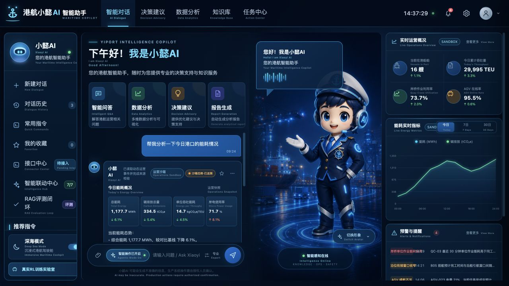
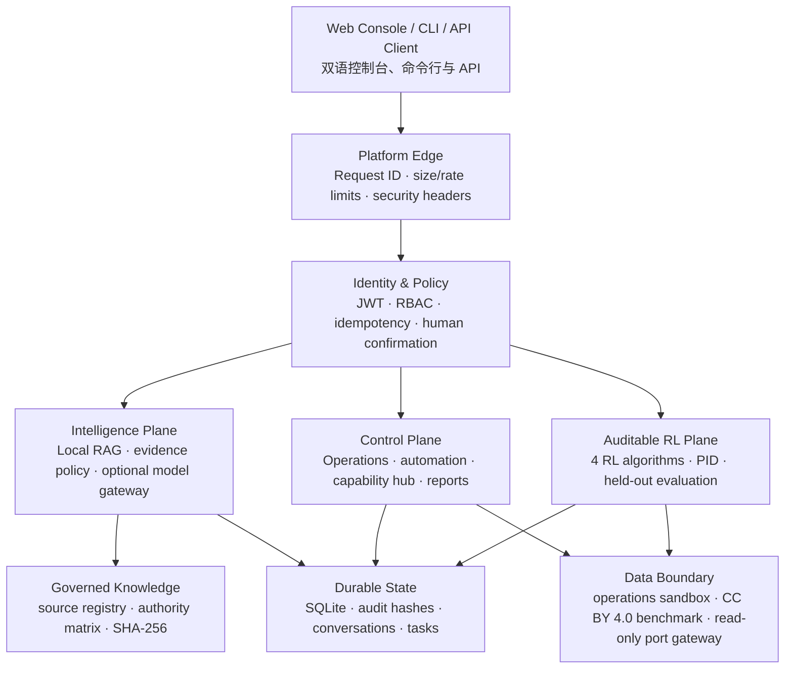
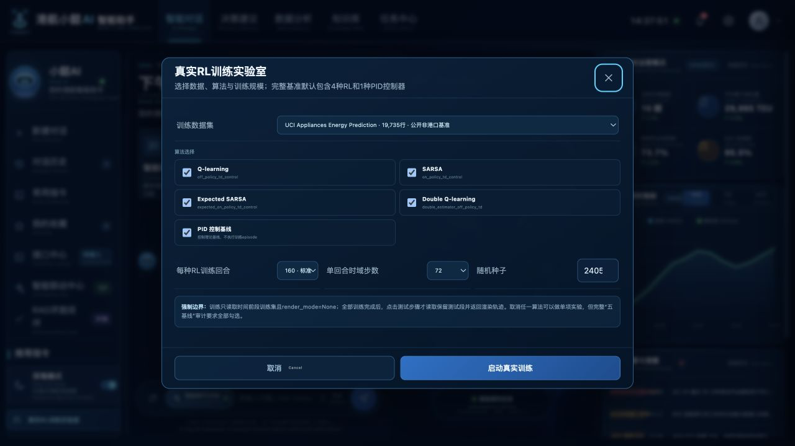

# 港航小懿 AI · Xiaoyi Maritime AI

<p align="center">
  <strong>证据治理型港航智能中枢与可审计强化学习实验平台</strong><br>
  <strong>Evidence-governed maritime intelligence and an auditable reinforcement-learning control plane</strong>
</p>

<p align="center">
  <a href="https://github.com/wenjiayi123/xiaoyi-maritime-ai/actions/workflows/ci.yml"></a>
  
  
  
  
  
  
  
</p>

<p align="center">
  <a href="#系统定位--system-positioning">系统定位</a> ·
  <a href="#architecture--系统架构">Architecture</a> ·
  <a href="#快速开始--quick-start">快速开始</a> ·
  <a href="#可审计-rl-实验室--auditable-rl-lab">RL Lab</a> ·
  <a href="#可信边界--trust-boundaries">可信边界</a> ·
  <a href="docs/DEPLOYMENT.md">Deployment</a>
</p>



> **中文**：小懿把本地港航 RAG、来源治理、运营态势适配、智能操作、跨系统只读编排、持久审计和真实 CPU 强化学习训练统一到一个可复现的 FastAPI 控制平面中。默认配置不依赖外部模型、不连接真实港口、不执行生产写操作。
>
> **English**: Xiaoyi unifies local maritime RAG, source governance, operational data adapters, agentic workflows, read-only cross-system orchestration, durable audit trails, and real CPU-based RL training in one reproducible FastAPI control plane. The default profile uses no external model, connects to no live port, and performs no production write.

---

## 系统定位 · System positioning

这不是一个只展示聊天窗口的包装项目。它把“回答是否有证据、数据是否真实、训练是否真的发生、动作是否获得授权、状态是否可以追溯”作为一等工程约束。

This is more than a chat UI. Evidence quality, data authenticity, real training execution, action authorization, and state traceability are first-class engineering constraints.

| 能力层 / Layer | 实际实现 / What is implemented | 可审计信号 / Auditable signal |
|---|---|---|
| 港航知识智能 / Maritime intelligence | 112 份登记文档、708 个检索片段、本地 RAG、严格证据回答与拒答策略 / 112 registered documents, 708 retrieval chunks, local RAG, strict evidence composition and refusal | 来源登记、验证级别、辖区、复核日期、内容与索引 SHA-256 / source registry, verification level, jurisdiction, review date, content and index hashes |
| 运营态势 / Operations | 船舶、泊位、岸桥、AGV、闸口、能耗、告警、任务与报告的统一 `port-ops.v1` 契约 / unified `port-ops.v1` contract for vessels, berths, cranes, AGVs, gates, energy, alerts, tasks and reports | `mode`、`source_id`、观测时间、质量码、`live_data_verified` / mode, source ID, observation time, quality code, `live_data_verified` |
| 智能操作 / Agentic workflows | 白名单步骤解析、逐步执行、幂等写入、当前动作人工确认 / allowlisted planning, stepwise execution, idempotent mutation and action-scoped human confirmation | 请求 ID、操作者身份、步骤结果、持久审计链 / request ID, actor identity, step outcome and durable audit chain |
| 跨系统中枢 / Capability hub | TOS、PCS、EMS、EAM、VTS、AIS、气象和单一窗口连接器契约；四个内部系统只读能力路由 / connector contracts plus read-only routing across four internal systems | 默认 `offline`；仅登记的 GET 能力可在显式 `live` 模式调用 / offline by default; only registered GET capabilities can run in explicit live mode |
| 强化学习 / Reinforcement learning | Q-learning、SARSA、Expected SARSA、Double Q-learning 与 PID 五基线 / Q-learning, SARSA, Expected SARSA, Double Q-learning and a PID baseline | 时间切分、训练不渲染、真实 episode 计数、模型/配置/数据哈希、训练后保留测试轨迹 / temporal split, no-render training, real episode counters, model/config/data hashes and post-training held-out traces |
| 平台工程 / Platform engineering | JWT、四级 RBAC、限流、请求体限制、CORS/Host 门禁、持久幂等、SQLite 状态、深度就绪、Prometheus、JSON 日志 / JWT, four-role RBAC, rate and body limits, CORS/Host gates, durable idempotency, SQLite state, deep readiness, Prometheus and JSON logs | 生产配置失败关闭、`X-Request-ID`、健康分项与 206 项自动化测试 / fail-closed production configuration, request IDs, component readiness and 206 automated tests |

### 当前已验证快照 · Verified snapshot

以下数字来自本仓库 0.3.0 发布候选的实际运行状态，而不是路线图：

The following numbers are from the running 0.3.0 release candidate, not a roadmap:

| 指标 / Metric | 已验证值 / Verified value |
|---|---:|
| 自动化测试 / Automated tests | **206 passed** |
| 活跃 API 操作 / Active API operations | **85** |
| 知识文档 / Knowledge documents | **112** |
| 检索片段 / Retrieval chunks | **708** |
| 登记的官方或发布方公开来源摘要/目录 / registered official or publisher source summaries and locators | **60** |
| 权威覆盖矩阵条目 / Authority-coverage matrix entries | **41** |
| 公开 RL 时序观测 / Public RL observations | **19,735** |
| 算法与控制基线 / Learning and control baselines | **4 RL + 1 PID** |

`60` 表示已登记且带来源元数据的公开摘要或目录，不表示收录了 60 份可再分发的官方全文；`41` 项矩阵明确包含已索引、计划补齐和许可证隔离状态。项目禁止声称“全球完整覆盖”。

`60` means registered public summaries or locators with provenance metadata; it does not mean 60 redistributable official full texts. The `41`-entry matrix explicitly includes indexed, planned, and license-isolated states. The project prohibits claims of complete worldwide coverage.

## Architecture · 系统架构



浏览器永远不被视为可信身份来源。客户端提交的角色、生产标记、确认状态或进度值不能建立权限；JWT 模式由服务端验证的主体与角色覆盖客户端声明。

The browser is never an identity authority. Client-provided roles, production flags, confirmations, or progress values cannot establish permission; in JWT mode, server-verified subject and role claims override client assertions.

## 核心工程设计 · Core engineering design

### 1. 证据治理 RAG · Evidence-governed RAG

- 每份知识材料登记机构、来源 URL、验证级别、辖区、内容范围、复核日期和发布方条款。
  Every knowledge artifact records institution, source URL, verification level, jurisdiction, content scope, review date, and publisher terms.
- 检索结果返回来源与双 SHA-256；低证据覆盖时触发严格拒答，而不是补写看似合理的港航结论。
  Retrieval returns provenance and dual SHA-256 values; insufficient evidence triggers strict refusal instead of plausible-looking maritime claims.
- 默认 `local_rules` 不外发内容；可选 OpenAI-compatible 网关也必须通过证据、隐私和沙箱数据门禁。
  The default `local_rules` path sends nothing externally; the optional OpenAI-compatible gateway is still gated by evidence, privacy, and sandbox-data policy.

### 2. 生产数据失败关闭 · Fail-closed live-data integration

运营页面默认使用动态合成的 `operations_sandbox` 事件流，用于验证 UI、任务和数据契约。切换真实站点必须显式设置 `XIAOYI_PORT_DATA_MODE=live`，并由只读网关返回兼容的 `port-ops.v1` 与 `live_data_verified=true`；任一条件不满足都不会被标记为生产实绩。

The operations console defaults to a dynamically generated `operations_sandbox` event stream for UI, workflow, and contract validation. A live site must explicitly select `XIAOYI_PORT_DATA_MODE=live`, and the read-only gateway must return both a compatible `port-ops.v1` contract and `live_data_verified=true`. Otherwise the data can never be labeled as production fact.

### 3. 可审计智能操作 · Auditable agentic operation

自然语言首先解析为白名单步骤；每一步都在服务端读取最新数据、记录操作者与结果，并单独推进。高风险动作只返回 `requires_human_confirmation: true`，项目没有因为接入真实数据而自动获得生产写权限。

Natural language is first resolved into allowlisted steps. Each step reads current server-side data, records actor and outcome, and advances independently. High-risk actions return `requires_human_confirmation: true`; connecting live data never grants production write authority.

### 4. 持久控制平面 · Durable control plane

对话、任务、报告、自动化计划、反馈、审计与幂等结果持久化到 SQLite。重启时，未完成工作被明确标记为失败或取消，不会在缺少上下文时静默续跑。多实例生产部署需要按部署指南替换为共享数据库、持久队列和分布式限流/幂等存储。

Conversations, tasks, reports, automation plans, feedback, audit records, and idempotent responses persist in SQLite. On restart, incomplete work is explicitly failed or cancelled instead of silently resuming without context. Multi-instance production requires the shared database, durable queue, and distributed rate/idempotency services described in the deployment guide.

## 可审计 RL 实验室 · Auditable RL lab



实验室在本仓库内真实执行五个基线，不读取其他项目的预计算曲线：

The lab executes all five baselines inside this repository and does not replay precomputed curves from another project:

| 基线 / Baseline | 类型 / Type | 实际训练 / Real training |
|---|---|---|
| Q-learning | off-policy TD control | Yes |
| SARSA | on-policy TD control | Yes |
| Expected SARSA | expected on-policy TD control | Yes |
| Double Q-learning | double-estimator off-policy TD | Yes |
| PID | control-theory baseline | No episodes; evaluated on the same held-out task |

默认数据是 [UCI Appliances Energy Prediction](https://archive.ics.uci.edu/dataset/374/appliances+energy+prediction) 的 19,735 条十分钟级能源与气象观测，许可证为 CC BY 4.0。仓库保存下载地址、原始归档 SHA-256、派生 CSV SHA-256 和转换记录。它只用于公开算法基准，**不是港口或 AGV 实绩**。

The default dataset contains 19,735 ten-minute energy and weather observations from [UCI Appliances Energy Prediction](https://archive.ics.uci.edu/dataset/374/appliances+energy+prediction), licensed under CC BY 4.0. The repository records the download URL, source-archive SHA-256, derived-CSV SHA-256, and transformations. It is a public algorithm benchmark, **not port or AGV operational data**.

训练约束 / Training invariants:

1. 数据按时间切成训练、验证和保留测试段。 / Data is split chronologically into training, validation, and held-out test segments.
2. 训练路径强制 `render_mode=None`。 / The training path enforces `render_mode=None`.
3. 进度来自已完成 episode 数，不来自定时动画。 / Progress comes from completed episodes, never a timer animation.
4. 模型、配置和数据均计算 SHA-256。 / Model, configuration, and data artifacts are SHA-256 hashed.
5. 全部训练结束后，评估接口才读取保留测试段并生成轨迹。 / Only after all training completes may evaluation read the held-out split and generate a trace.

换成站点数据时，只需提供至少包含 `timestamp,load_kw` 的 CSV；电价、碳强度和气象列可通过环境变量映射，不需要改训练器。

To substitute site data, provide a CSV with at least `timestamp,load_kw`. Tariff, carbon-intensity, and weather columns can be mapped through environment variables without changing the trainers.

## 可信边界 · Trust boundaries

| 资源 / Resource | 仓库默认 / Repository default | 可以证明 / What it proves | 不能声称 / What it must not claim |
|---|---|---|---|
| 运营态势 / Operations | 动态 `operations_sandbox` | UI、流程、契约和失败边界 / UI, workflow, contract and failure-boundary behavior | 真实港口当前实绩 / current live-port fact |
| RL 数据 / RL data | UCI 公开建筑能源数据 | 可复现的时序控制基准 / reproducible time-series control benchmark | 港口、岸桥或 AGV 训练证据 / port, crane or AGV training evidence |
| 港航知识 / Maritime knowledge | 原创整理、公开摘要和官方目录定位 | 有来源的主题导航和有限事实 / sourced navigation and bounded facts | 官方全文、全球完整或现行法律意见 / official full text, global completeness or legal advice |
| 连接器 / Connectors | 全部 `offline` | 字段、鉴权和健康检查契约 / field, auth and health-check contracts | 已接 TOS/PCS/EMS 等生产系统 / a live TOS, PCS, EMS or other system |
| 模型生成 / Model generation | `local_rules` | 本地严格证据回答 / local evidence-controlled responses | 已调用外部大模型 / use of an external LLM |
| 生产动作 / Production action | 禁用 | 预检、授权和人工确认边界 / preflight, authorization and confirmation boundary | 无人值守自动控制 / unattended autonomous control |

## 快速开始 · Quick start

### 本地运行 · Local run

```bash
git clone https://github.com/wenjiayi123/xiaoyi-maritime-ai.git
cd xiaoyi-maritime-ai
bash run.sh
```

首次运行会创建 `.venv`、安装锁定依赖、校验公开 RL 数据并重建知识索引。打开 <http://127.0.0.1:8010>。

The first run creates `.venv`, installs locked dependencies, verifies the public RL data, and rebuilds the knowledge index. Open <http://127.0.0.1:8010>.

### 手动安装 · Manual setup

```bash
python3 -m venv .venv
source .venv/bin/activate
python -m pip install -r requirements-dev.lock
python scripts/build_index.py
python -m uvicorn app.main:app --host 127.0.0.1 --port 8010
```

### 容器 · Container

```bash
docker compose build
docker compose up
```

Compose 默认只绑定回环地址，删除 Linux capabilities，使用只读根文件系统，并用三个命名卷分别持久化运行数据库、RL 产物和待审核知识资料；知识源、公开数据与构建索引保持在不可变镜像层。

The Compose profile binds to loopback by default, drops Linux capabilities, uses a read-only root filesystem, and persists the runtime database, RL artifacts, and pending knowledge intake in three named volumes. Knowledge sources, public data, and the built index remain in the immutable image layer.

## API 面 · API surface

服务提供 85 个活跃 API 操作。开发环境启用 OpenAPI 文档：<http://127.0.0.1:8010/docs>。

The service exposes 85 active API operations. OpenAPI is available in development at <http://127.0.0.1:8010/docs>.

```text
POST /api/chat                         证据治理问答 / evidence-governed chat
POST /api/chat/stream                  SSE 流式回答 / streaming response
GET  /api/knowledge/status             知识与索引状态 / knowledge and index state
POST /api/knowledge/search             带来源检索 / provenance-aware retrieval
GET  /api/runtime/status               运营数据边界 / operational data boundary
GET  /api/dashboard                    运营聚合 / operational aggregation
POST /api/automation/plans             白名单智能计划 / allowlisted agentic plan
POST /api/orchestrator/run             跨系统只读编排 / read-only orchestration
POST /api/rl-lab/runs                  创建真实训练 / start real training
POST /api/rl-lab/runs/{id}/evaluate    保留测试评估 / held-out evaluation
GET  /api/governance/audit             持久审计 / durable audit trail
GET  /health/ready                     深度就绪 / deep readiness
GET  /metrics                          Prometheus 指标 / metrics
```

完整契约以运行时 `/openapi.json` 为准。运营适配见 [PORT_OPERATIONS_DATA_ADAPTER.md](docs/PORT_OPERATIONS_DATA_ADAPTER.md)，连接器见 [PORT_CONNECTOR_INTEGRATION.md](docs/PORT_CONNECTOR_INTEGRATION.md)。

The runtime `/openapi.json` is authoritative. See [PORT_OPERATIONS_DATA_ADAPTER.md](docs/PORT_OPERATIONS_DATA_ADAPTER.md) for the operational adapter and [PORT_CONNECTOR_INTEGRATION.md](docs/PORT_CONNECTOR_INTEGRATION.md) for connector contracts.

## 安全与部署 · Security and deployment

本地模式只允许回环开发。生产模式必须使用签名 JWT、显式主机名与 CORS 来源，否则启动失败。外部 TLS、组织 SSO/OIDC、密钥管理、网络白名单、集中日志、备份和多实例任务队列由部署方提供。

Local mode is for loopback development only. Production requires signed JWTs, explicit hosts, and explicit CORS origins; otherwise startup fails. TLS, organizational SSO/OIDC, secret management, network allowlists, centralized logs, backup, and a multi-instance job queue remain deployment responsibilities.

```dotenv
XIAOYI_ENV=production
XIAOYI_SECURITY_MODE=jwt
XIAOYI_JWT_SECRET=<at-least-32-random-bytes-from-a-secret-manager>
XIAOYI_ALLOWED_HOSTS=assistant.example.com
XIAOYI_CORS_ORIGINS=https://assistant.example.com
XIAOYI_DOCS_ENABLED=false
```

部署前请阅读 [SECURITY.md](SECURITY.md)、[DEPLOYMENT.md](docs/DEPLOYMENT.md) 和 [OPEN_SOURCE_READINESS.md](docs/OPEN_SOURCE_READINESS.md)。

Read [SECURITY.md](SECURITY.md), [DEPLOYMENT.md](docs/DEPLOYMENT.md), and [OPEN_SOURCE_READINESS.md](docs/OPEN_SOURCE_READINESS.md) before deployment.

## 发布验证 · Release verification

```bash
python -m compileall -q app scripts
python scripts/release_check.py
python -m pip check
node --check web/app.js
python -m pytest -q
```

发布门禁验证治理文件、公开数据许可证与血缘哈希、危险凭据模式、前端语法和全部测试。CI 使用锁定依赖并重建知识索引。

The release gate verifies governance artifacts, public-data licensing and provenance hashes, high-confidence secret patterns, frontend syntax, and the full test suite. CI uses locked dependencies and rebuilds the knowledge index.

## 仓库结构 · Repository map

```text
app/
  main.py                 FastAPI composition root
  security.py             JWT, RBAC, limits, headers and request tracing
  knowledge_api.py        governed knowledge endpoints
  port_runtime.py         sandbox/live port-ops.v1 data adapter
  operations.py           dashboard, task and report services
  automation.py           allowlisted agentic workflow engine
  capability_hub.py       read-only cross-system capability registry
  model_gateway.py        privacy- and evidence-gated model adapter
  rl_lab/                 datasets, environment, four RL algorithms, PID, workers
data/
  kb/                     project-authored maritime summaries and source locators
  public/                 CC BY 4.0 benchmark plus provenance record
  source_registry.json    source metadata and verification scope
  authority_coverage.json auditable partial-coverage and known-gap matrix
web/                      bilingual native-Web console
tests/                    security, RAG, operations, connectors, workflows and RL
docs/                     architecture, deployment, governance and integration guides
```

## 文档导航 · Documentation

| 文档 / Document | 内容 / Scope |
|---|---|
| [Architecture](docs/ARCHITECTURE.md) | 架构与信任边界 / architecture and trust boundaries |
| [Deployment](docs/DEPLOYMENT.md) | 生产配置、恢复与扩展边界 / production configuration, recovery and scaling |
| [Open-source readiness](docs/OPEN_SOURCE_READINESS.md) | 真实性审计和上线前责任 / authenticity audit and deployment responsibilities |
| [Knowledge governance](docs/KNOWLEDGE_GOVERNANCE.md) | 来源、审核、发布、拒答与复核 / sourcing, review, publication, refusal and revalidation |
| [Port connector integration](docs/PORT_CONNECTOR_INTEGRATION.md) | 八类港口系统连接器契约 / contracts for eight port-system categories |
| [RL mission guide](docs/RL_AGV_ENERGY_MISSION_GUIDE.md) | 数据契约、算法、训练与评估 / data contract, algorithms, training and evaluation |
| [Frontline operator guide](docs/XIAOYI_FRONTLINE_OPERATOR_SYSTEM_GUIDE.md) | 一线值班、调度和交接班工作流 / frontline duty, dispatch and handover workflows |
| [Intelligence hub](docs/XIAOYI_INTELLIGENCE_HUB.md) | 跨系统能力中枢与证据融合 / cross-system capability hub and evidence fusion |
| [v0.3.0 release notes](docs/releases/v0.3.0.md) | 当前版本能力、验证证据与边界 / current release capabilities, evidence and boundaries |

## 参与、支持与引用 · Contributing, support and citation

- 参与贡献 / Contributing: [CONTRIBUTING.md](CONTRIBUTING.md)
- 安全披露 / Security disclosure: [SECURITY.md](SECURITY.md)
- 支持边界 / Support boundary: [SUPPORT.md](SUPPORT.md)
- 治理模型 / Governance: [GOVERNANCE.md](GOVERNANCE.md)
- 第三方归属 / Third-party attribution: [THIRD_PARTY_NOTICES.md](THIRD_PARTY_NOTICES.md)
- 软件引用 / Software citation: [CITATION.cff](CITATION.cff)

代码与项目原创文档采用 [MIT License](LICENSE)。外部标准、法规网页、商标和公开数据仍适用各自发布方条款；UCI 派生数据采用 CC BY 4.0。

Code and project-authored documentation are released under the [MIT License](LICENSE). External standards, regulatory pages, trademarks, and public data remain subject to their publisher terms; the derived UCI dataset is CC BY 4.0.

---

<p align="center">
  <strong>把可追溯、可拒答、可复现和失败关闭带进港航 AI。</strong><br>
  <strong>Bringing traceability, refusal, reproducibility, and fail-closed behavior to maritime AI.</strong>
</p>
