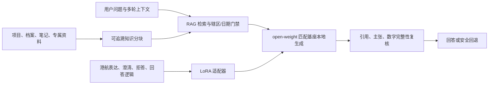

# 小懿：开源底座 + RAG + LoRA 生成式大模型方案

更新日期：2026-07-27

## 已选模型与本机适配

当前机器是 8 核 Intel Core i9-9880H、16GB 内存、Radeon Pro 560X 4GB，
可用磁盘空间约 40GiB。默认选择：

- 生成基座：`xiaoyi-local-generation-4b`
- 文件契约：`maritime-generation-4b-q4-k-m.gguf`
- 参数规模：4B
- 量化：Q4_K_M
- 本地文件约 2.50GB
- 许可：Apache-2.0
- 推理：llama.cpp，CPU、mmap、8K 上下文
- 本机 LoRA 证明基座：`xiaoyi-local-training-1.7b`
- 本机 LoRA 推理文件契约：`maritime-training-1.7b-q8-0.gguf`
- 稠密向量模型：`xiaoyi-local-embedding-0.6b` Q8_0，1024维

默认 4B 比 1.7B 更适合作为中文港航自然对话底座，又能为 FastAPI、RAG 索引、
KV Cache 和操作系统留出内存。另设 1.7B，是为了在这台 16GB Intel Mac 上建立
“训练基座—PEFT 适配器—同架构 GGUF 推理”的真实 LoRA 闭环；1.7B 适配器绝不
挂到 4B 上，也不把 1.7B 的训练说成 4B 已微调。8B/14B 在本机的首字延迟、
吞吐、上下文空间和稳定性不适合作为默认工程基线。

公共仓库只记录参数规模、量化、字节数、上下文、许可和环境变量契约；具体权重
来源、固定 revision、下载地址与校验摘要由部署侧私有清单提供。模型权重写入
`.runtime/models/` 或由绝对路径引用，不会提交 Git。

## 三层职责



- 开源底座负责语言理解、多轮对话和自然生成。
- RAG 负责当前事实、私有资料、法规版本和可追溯引用。
- LoRA 负责港航术语、表达风格、澄清策略、回答结构和安全拒答逻辑。
- 回答后门禁继续检查引用编号、主张词面对齐以及数字/日期是否来自证据。

LoRA 不替代 RAG。把全部文档直接训练进参数会失去来源定位、版本替换和删除
能力，也更容易把过时或错误资料固化进模型。

## 下载、校验与运行

```bash
cd <xiaoyi-ai-repository>
.venv/bin/python scripts/local_model.py install-runtime
export XIAOYI_LOCAL_MODEL_PATH=/absolute/path/to/maritime-generation-4b-q4-k-m.gguf
export XIAOYI_EMBEDDING_MODEL_PATH=/absolute/path/to/maritime-embedding-0.6b-q8-0.gguf
.venv/bin/python scripts/local_model.py verify
bash run.sh
```

如需使用下载器，应另外配置部署侧的
`XIAOYI_LOCAL_MODEL_DOWNLOAD_URL`、`XIAOYI_EMBEDDING_MODEL_DOWNLOAD_URL`
和对应 SHA-256 环境变量；公共仓库不内置权重供应商地址。

`run.sh` 在模型和 `llama-server` 均存在时自动启动本地生成层：

```text
4B Q4_K_M -> http://127.0.0.1:11435/v1
0.6B-Embedding   -> http://127.0.0.1:11436/v1
小懿 FastAPI     -> http://127.0.0.1:8010
```

Embedding 服务会为每个带内容哈希的知识分块生成真实 1024 维归一化向量并写入
`data/xiaoyi_vector_index.json`（本地生成文件，不提交 Git）。查询端使用港航
证据检索 instruction 生成查询向量，与 Sparse/BM25、来源质量、辖区、日期和
覆盖率共同排序；向量服务或索引失效时自动回退，不会把余弦相似度冒充事实证明。

关闭生成层并只保留确定性严格证据回答器：

```bash
XIAOYI_GENERATIVE_MODEL_ENABLED=false bash run.sh
```

模型运行日志位于 `.runtime/logs/llama-server.log`。`GET /api/models` 会返回
`architecture=open_weight_llm_rag_lora`、`request_scope=local_device` 和
当前模型/适配器信息。本地回环调用不会产生资料外发；远程模型仍需显式授权。

## LoRA 数据

```bash
.venv/bin/python scripts/build_lora_dataset.py
```

构建器只抽取知识库中人工明确写出的“常见问法 / 等价问法 / 直接回答”：

1. 固定评测中完全相同的问题从训练候选中排除；
2. 按来源文档切分 Train / Validation / Test；
3. 同一来源不会跨集合，减少同答案改写造成的数据泄漏；
4. 每个样本保留来源文件和来源 SHA-256；
5. 不自动生成监督答案，不把来源目录或任意文档段落冒充训练标签。

输出位于 `.runtime/finetuning/xiaoyi-maritime-sft-v1/`，其中
`manifest.json` 固化样本数、来源集合、切分和各文件哈希。

## LoRA 训练与本机边界

当前 Intel Mac 适合数据治理、GGUF 推理和端到端功能验收。项目固定最后一条
仍提供 Intel macOS wheel 的 PyTorch 2.2.2，用 1.7B 做极短 CPU LoRA
工程证明；它速度慢、上下文短，只能证明训练和适配器产物链路，不能冒充完整
训练、领域效果或 4B 已微调。4B 正式 LoRA 仍应走 Linux/NVIDIA。

本机工程证明：

```bash
python3 -m venv .venv-lora
.venv-lora/bin/python -m pip install -r requirements-lora-intel-mac.lock
export XIAOYI_LORA_BASE_MODEL=/absolute/path/to/maritime-training-1.7b
export XIAOYI_LORA_MODEL_PATH=/absolute/path/to/maritime-training-1.7b-q8-0.gguf
.venv-lora/bin/python scripts/build_lora_dataset.py \
  --output-dir .runtime/finetuning/xiaoyi-maritime-sft-v3
.venv-lora/bin/python scripts/train_lora.py \
  --dataset-dir .runtime/finetuning/xiaoyi-maritime-sft-v3 \
  --output-dir artifacts/lora/xiaoyi-maritime-1.7b-r96-v3 \
  --rank 96 --alpha 192 --max-steps 64 --max-length 128 \
  --validation-cases 8 --test-cases 8 --learning-rate 3e-5
.venv-lora/bin/python scripts/export_lora_gguf.py \
  --adapter-dir artifacts/lora/xiaoyi-maritime-1.7b-r96-v3 \
  --output artifacts/lora/xiaoyi-maritime-1.7b-r96-v3/xiaoyi-maritime-1.7b-r96-v3-f16.gguf
```

### 2026-07-27 本机已完成证据

- 从 15 份内部人工整理问答来源及42条人工审核监督样本构建841条监督数据，
  按来源隔离为 Train 622 / Validation 94 / Test 125，并在构建前排除
  212条固定评测问题。
- 在部署侧固定的 `xiaoyi-local-training-1.7b` 权重上完成 rank 96、alpha 192、长度128、
  64 step CPU LoRA；训练104,595,456 / 1,825,170,432个参数，即
  5.730723%。
- 8条隔离验证样本平均loss从4.880868降至2.755390（下降43.55%）；
  8条隔离测试样本从5.356009降至3.187271（下降40.49%）。这里只把loss
  下降写作固定样本上的优化信号，不冒充回答准确率、独立业务人员盲评或生产性能。
- PEFT适配器SHA-256：
  `d277abd0cc6155f682e3fd2293a56da2bead7a047fbf8d3678dce2a30e3bd46a`。
  导出的209,218,240字节GGUF LoRA SHA-256：
  `2160da946ab4adcada579d9db0fa1d812285c7fbd418f6c09679bd95e546edfb`。
- llama.cpp b10107 已用匹配的 1.7B Q8_0 + GGUF LoRA 完成真实生成；
  `/api/chat` 端到端探针确认 `generation_fallback=false`，并输出回答后
  引用、词面对齐和数字完整性报告。
- 0.6B-Embedding 已为 882 个知识分块生成 1024 维 L2 归一化向量；
  单查询探针仅证明编码器与索引联通，不冒充检索质量基准。

证据报告：

- `reports/local_lora_inference_v3.json`
- `reports/local_rag_lora_e2e_v3.json`
- `reports/local_dense_retrieval_v1.json`

可复现正式训练应使用 Linux + NVIDIA GPU：

```bash
python -m venv .venv-lora
source .venv-lora/bin/activate
pip install -r requirements-lora.txt
python scripts/build_lora_dataset.py
python scripts/train_lora.py
```

本机已完成 1.7B、rank 96、alpha 192、最大长度128的64步CPU训练；
正式 Linux/NVIDIA 配置必须扩大数据步数和上下文并建立基座对照。两条路径都只
更新适配器层，输出 `adapter_model.safetensors`、`adapter_config.json` 和
`training_report.json`。训练报告记录模型、数据哈希、硬件、超参数、
训练/验证损失与证据边界。

完成正式训练后，使用与当前 llama.cpp 版本匹配的
`scripts/export_lora_gguf.py` 调用匹配版本的 `convert_lora_to_gguf.py`
将 PEFT 适配器转换为 GGUF，然后通过
`llama-server --lora <adapter.gguf>` 加载。适配器必须声明
`xiaoyi-local-training-1.7b`，不得跨模型族或跨参数规模套用。`run.sh` 默认使用未微调的
4B 高质量生成档；设置 `XIAOYI_LOCAL_MODEL_PROFILE=lora` 才会显式启用已校验
的 1.7B + GGUF LoRA 工程证明档。

## 晋级门禁

一次能跑通的 LoRA 训练不等于领域能力提升。适配器只有同时满足以下条件才可
成为默认版本：

- 固定 Test 集优于或不劣于基座；
- RAG 检索、辖区、日期、实时数据和拒答基准不退化；
- 引用、主张和数字完整性门禁不退化；
- 对话流畅度由未参与训练的港航人员盲评；
- 记录基座/适配器版本、数据清单、种子、损失曲线和回滚方法；
- 不把训练损失、固定题通过率或内部盲评冒充港口生产准确率。

## 尚未完成的外部条件

- 当前未接授权法规全文与港口生产 TOS/PCS/AIS/VTS；
- 本机的 1.7B LoRA 只属于工程证明；4B 正式 LoRA 训练仍需要合适的
  Linux/NVIDIA 算力；
- 尚无未参与训练的第三方港航业务人员盲测；
- 因此当前定位是“本地开源生成基座已接入、RAG/LoRA 工程闭环已建立”，
  不是已完成现场部署的行业基础模型。
